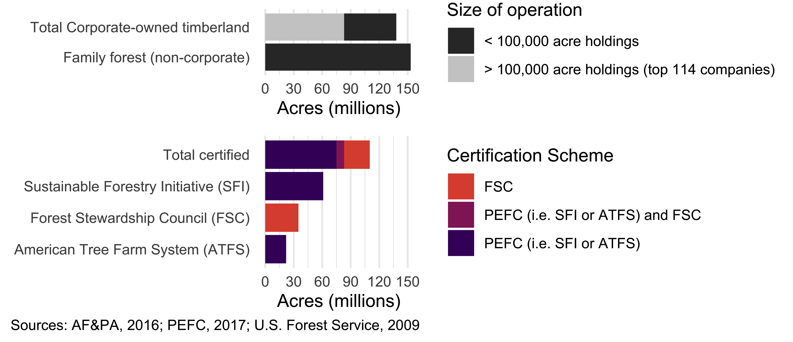
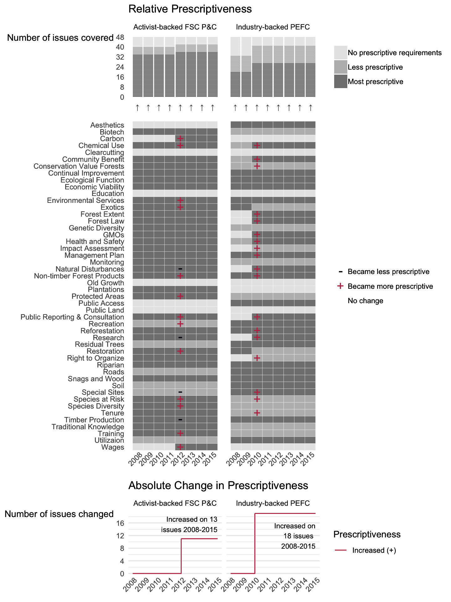
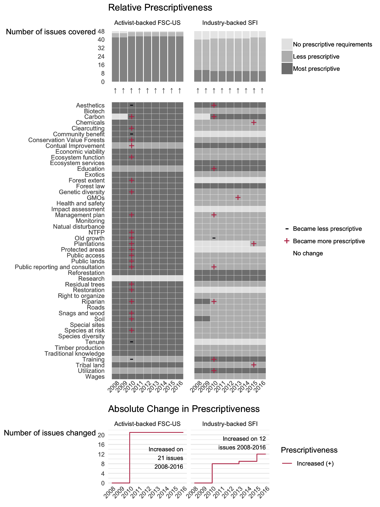
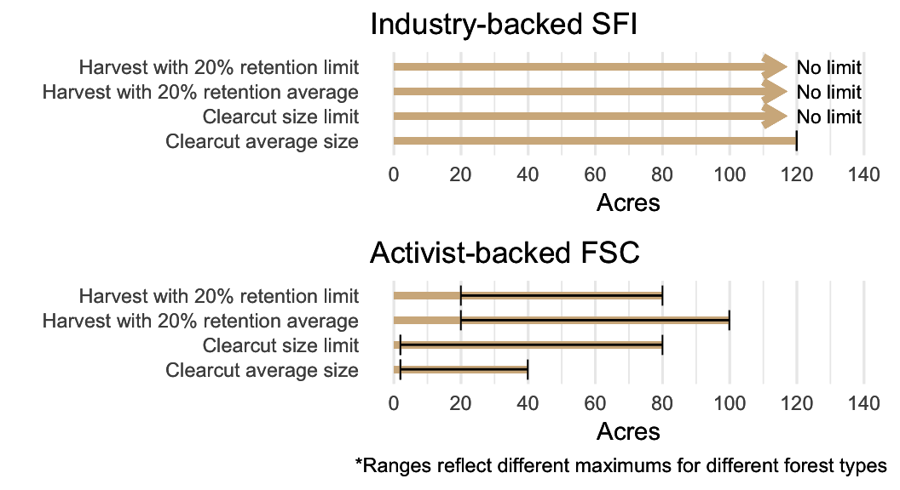
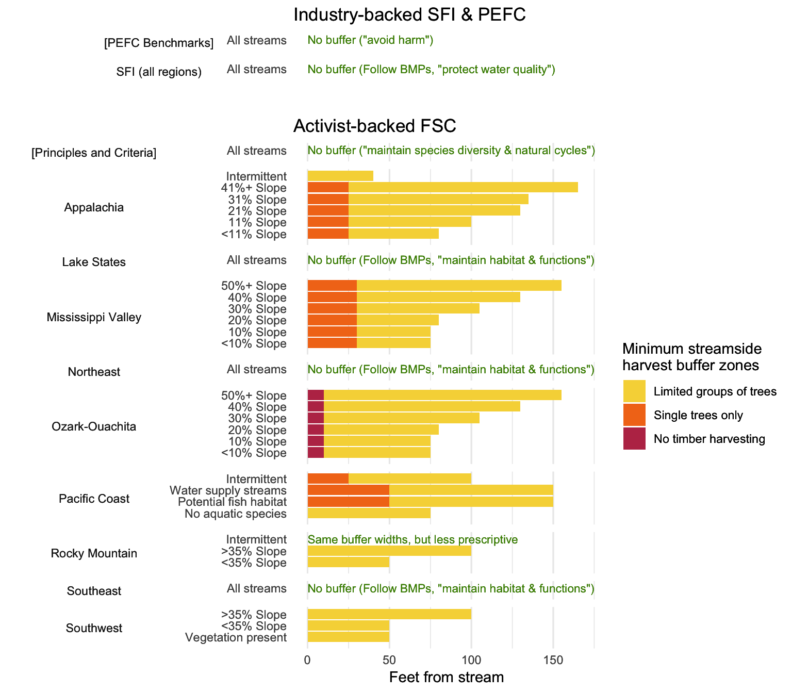

\newpage

# Introduction
Private governance initiatives, such as product certification programs, have targeted farm and factory working conditions, greenhouse gas emissions, and fishery, mining, and forest management [@Auld2014; @Bartley2003; @Bozzi2012; @Hudson2003; @VanderVen2015; @Vince2017]. Many of these programs were founded by activists who were dissatisfied with public regulations. Activists use tactics such as boycotts as “sticks” and brand-boosting praise as “carrots” to pressure companies to comply with certification programs that often exceed the requirements of public laws [@Cashore2002]. When companies agree to add certification requirements to their purchasing policies and contracts, those certification programs gain power to regulate how commodities are produced. Industry groups often resist these efforts at private (i.e. non-state) regulation, in some cases launching competing certification programs to offer more “business-friendly” alternatives. 

Public debates among supporters of activist-backed programs and industry-backed alternatives often center on the relative stringency of each program’s regulatory requirements. Assertions about the levels of stringency are part of a legitimation process through which competing systems achieve, maintain, or lose, policymaking authority [@Bartley2007; @Bodansky1999; @Cashore2002]. The stringency of program requirements is often central to both positive and negative evaluations of legitimacy among those they aim to empower and those they seek to regulate.^[ @Cashore2004 found that while environmental groups evaluated the FSC as legitimate for developing wide-ranging and prescriptive standards, private forest owners found the same regulatory approach to be “illegitimate.”]

Concepts of regulatory stringency are also at the center of conflicting theoretical and empirical claims from scholars across political science, economics, and sociology, concerning the likely effects and future trajectories of private regulations. A key motivation behind this research is to assess whether the social and market forces that shape private regulations lead to patterns similar to those observed in public regulations, such as a “race to the bottom” as governments or programs try to attract firms with less stringent regulations, a “race to the middle” as shared expectations emerge, or a “race to the top” as companies operating in areas with more stringent regulations lobby to equalize requirements across jurisdictions [@Berger1996; @Vogel1995]. While public policy scholars have spent a great deal of effort developing concepts of regulatory stringency and policy change needed to assess these hypotheses [@Green-Pedersen2007; @Hall1993; @Howlett2014], private governance scholarship gives much less attention to measuring policy change or regulatory stringency. This limited attention has led to seemingly contradictory empirical findings and hindered theory development and testing about how and why private regulations change.

To address this gap, we build on taxonomies from the public policy literature to offer a two-part framework to describe and compare regulations over time. Part one distinguishes three types of regulatory stringency: 1) How comprehensive is the scope of issues addressed? 2) How prescriptive are the requirements?  3) What are the specific levels of performance required? Part two offers a method to classify changes across programs, yielding nine possible patterns to describe both relative and absolute directions of policy change. This approach provides a common language to describe how various regulations in the same policy space may change over time. Such a systematic framework is especially important where complex and often contentious regulatory standards contain many different social, environmental, and economic requirements and where multiple programs, backed by different coalitions, develop alternative standards that compete for legitimacy and regulatory authority. 

We proceed in the following steps. Section two maps the different concepts and measures of regulatory stringency in existing private governance scholarship. Section three details our framework for measuring regulatory stringency. Section four applies the framework to compare competing certification programs in the U.S. forestry sector, arguably one of the most institutionalized areas of private regulation. Section five discusses the implications of our results for theory and outlines future research questions emerging from our findings.

# Regulatory stringency 
Concepts of regulatory stringency are required to test theories about how policy content shapes activist support, market adoption, social or ecological impacts, and how other programs respond (i.e., theories where regulatory requirements are an explanatory variable). Similarly, concepts of regulatory stringency are required to assess how activist campaigns, market forces, and competition among programs affect policy development and content (i.e., theories where regulatory requirements as the dependent variable).

*Stringency as an explanatory variable:* Scholars who study how private regulations gain legitimacy, trust, or support from various audiences posit that regulatory stringency influences these outcomes. For example, @McDermott2012 argues that stringency may reduce trust by mandating formulaic, top-down approaches.  Perceived stringency may increase market demand for certified products [@Atkinson2014] but may also reduce adoption by firms [@Prado2013].  Changes in stringency that disadvantage some firms or groups may catalyze these actors to create alternative private regulatory programs [@Meidinger2003]. Alternatively, those disadvantaged by changes to private regulation may then opt to pursue their aims through public policy [@Weimer2006]. Such outcomes would be consistent with broader findings from literatures on “corporate social responsibility” (CSR) initiatives, such as environmental management systems (EMS), industry codes of conduct, and third-party certification programs, which find that more costly requirements are less likely to be adopted [@Delmas2008; @Kollman2001; @Lyon2008]. This is because firms will only adopt costly requirements if there is a countervailing benefit of certification, whether an abstract “social license to operate” or more a concrete benefit like market access or a price premium. In contrast, practices that benefit firms need no such countervailing benefit from certification for firms to adopt them. 

The effects of stringency on trust, legitimacy, compliance cost, and adoption matter because anticipating the impact of private regulations “on the ground” requires understanding their evolutionary trajectories [@VanderVen2018]. These are complex empirical questions. Even activist-backed programs that establish stringent requirements on one issue at one point in time may not do so on other issues and at other times [@LeBaron2018] and nuanced gaps or “loopholes” in otherwise stringent private regulations may explain their lack of success in addressing problems such as deforestation [@VanderVen2018]. Together, these theories emphasize how regulatory stringency affects the adoption of and support for private governance systems as well as their potential to address social and ecological problems. 

*Stringency as a dependent variable:* Regulatory stringency is a main dependent variable in theories that explain how ideological, economic, political, and social forces work to shape and constrain policy content over time [@Bartley2003; @Cashore2004; @Fischer2014]. 

Differing ideas about the political responsibilities of businesses shape both activist demands for private governance and firms’ responses to private governance efforts [@Bartley2003; @Djelic2017]. These different ideas are then embodied in more or less stringent policies depending on which coalitions gain rulemaking authority [@Botzem2012; @Hsueh2012]. For example, @Bartley2003 finds private regulations emerging when social movements target companies with tactics that aim to redirect, rather than challenge, neo-liberal ideas. Others find private regulations arising from collective action by industry to preempt or replace more stringent government regulations [@Bartley2007; @Cashore2002; @Grabosky2013; @Green2013; @Loconto2014; @Lyon2008; @Maxwell2000; @Prakash2000]. @Abbott2009 suggest that the content of public and private regulations is a joint result of bargaining between activists and firms. The common thread is that each of these studies aims to explain relative differences or changes in policy content. 

Others seek to explain variation in regulatory stringency as a result of endogenous interactions among private authorities [@DeLeon2009; @Eberlein2014; @Green2017; @Gulbrandsen2014; @Howard-Grenville2008; @Li2015; @Mills2016d]. For example, @Smith2010 suggest that competing private regulations will change frequently and often imitate each other. Similarly, @Eberlein2014 identify “frequent rule revision” or “differentiation among rule systems” as potential effects of such interaction.  

A related body of scholarship seeks to explain regulatory stringency as a result of strategic interactions among the coalitions backing competing programs. Some focus on how competition may lead to more “weak or lax standards” as firms “shop” for lower-cost programs, potentially causing a “race to the bottom” [@Abbott2010; @Fransen2011; @Gulbrandsen2004]. In contrast, others find competition causing “weak” regulations to be “revised upwards” as activists invite public comparisons with the requirements of “higher” regulations [@Overdevest2005; @Overdevest2010]. And still others find both patterns occurring, depending on market and industry structures [@Cashore2004; @Hassel2008; @VanderVen2015]. @Cashore2004 highlight how market and institutional logics initially pressure coalitions to “lower” stringency but later work to maintain differences.

Concepts of regulatory stringency are also at the core of formal models of private governance. Theories suggest that standards may increase or decrease stringency under different conditions, such as increases or decreases in compliance costs or market demand [@Abderrazak2009; @Fischer2014]. Formal models [@Fischer2014; @Li2015; @Poret2016] and empirical research [@Cashore2004] both suggest that asymmetric incentives lead competing programs to adopt different levels of stringency in equilibrium. Where an activist-backed regulation competes with an industry-backed regulation, these theories predict that the activist-backed program will end up being more stringent. 

While these theories offer logical hypotheses, inadequate attention to the dependent variable they seek to explain has hindered efforts to assess them. The result is contradictory findings, especially regarding patterns of change. Some posit—and find evidence for—a pattern where competing regulations “ratchet up” with less stringent regulations converging toward more stringent ones [@Overdevest2005; @Overdevest2010; @Overdevest2014].  Others posit—and find evidence for—the exact opposite pattern, in which competitive pressures lead a “race to the bottom” with more stringent programs decreasing stringency and converging toward less stringent ones in [@Abbott2010; @Fransen2011; @Gulbrandsen2004]. Still others posit—and find evidence for—yet another pattern where programs maintain different levels of stringency, i.e., they remain distinct, neither converging to the “top” nor the “bottom” [@Cashore2004]. While these three sets of findings seem incompatible, we argue that they are the result of different measurement strategies. Reconciling them thus requires a set of shared concepts and measures of regulatory stringency.  

## Concepts & Measurement of Variation in Private Regulations 
The diversity of private governance scholars’ conceptual and empirical approaches to measuring regulatory stringency makes this literature vibrant but confusing: Some scholars evoke vertical notions of variation, describing standards as high or low or more or less stringent [@Fischer2014; @Li2015]. Others evoke horizontal notions of variation, describing the width or breadth of issues covered [@Auld2014; @Heyes2017]. @Cashore2007 call attention to variation in flexibility versus prescriptiveness, the extent to which regulations use mandatory and substantive performance thresholds. Others measure high and low stringency in a relative sense, defining a “benchmark” standard against which others are measured [@Overdevest2005; @Overdevest2010]. Still others combine concepts of breadth and prescriptiveness into a broader notion of stringency [@Fransen2011]. These distinct dimensions of stringency are often overlooked or conflated. For example, formal models often assign each program a single overall “quality” or “stringency” parameter that could be measured in multiple ways yielding different empirical results. And these are only a few of the many measures of stringency used in this literature, ranging from approaches so broad that they conflate many of these concepts to so narrow that they measure only a few select components of just one (see Table \ref{review}). 

Overall, as noted by @Brunel2016 and @Howlett2007, concepts of stringency in existing work tend to be either insufficiently precise to be consistently applied across programs, insufficiently comprehensive to yield consistent results, or completely absent.

\input{review}

In the absence of consistent measures of regulatory stringency, scholars have turned to proxy measures. For example, @Darnall2010 consider a program’s sponsor to be a signal of its stringency. In the broadest study to date, @VanderVen2015 uses another common proxy for stringency--compliance with *perceived* “best practices,” often considered “benchmarks” for measuring stringency but based on a variety of different notions of “rigor” and “credibility.” As a result, these approaches cannot examine relationships between stringency and program sponsorship or between stringency and perceived stringency.

More importantly, different approaches to measuring regulatory stringency prevent us from adjudicating between claims that competing programs will “race to the bottom,” “ratchet up,” “converge,” or “diverge.” Indeed, different measurement strategies explain the seemly contradictory evidence in favor or each theory. While @VanderVen2015 does find support for the prediction that activist-backed private regulations are more likely to align with “best practices,” he does not find support for the prediction that industry-backed regulations are less likely to do so. The latter finding seems to contradict findings by @Cashore2004 that industry-backed programs set less stringent requirements. However, this is due to differences in measurement; Cashore et al. focus on the prescriptiveness of substantive regulatory requirements, while van der Ven focuses on stakeholder engagement and other forms of procedural “best practices”—two distinct notions of stringency.

Two common challenges have hindered efforts to identify patterns of policy change. First, results vary depending on the policy components studied. Even the handful of scholars who have developed direct and precise measures of stringency (the top of Table \ref{review}) tend to only focus on a few salient components, rather than attempting to assess the entire range of requirements that regulations address. This approach can lead to conflicting results if scholars select different policy components as indicators of stringency. For example, to compare forestry certification programs, @Cashore2004 assess prescriptiveness on seven issues related to ecological protection (restrictions on the use of plantation forestry, chemicals, clearcuts, exotics, reserves, streamside riparian zones, and genetically modified organisms) and find large enduring differences between activist-backed and industry-backed programs. In contrast, @Overdevest2014 compared these same programs on six other features—two substantive requirements on firm behavior (public reporting and stakeholder consultation), two on compliance mechanisms (auditing and supply chain tracking), and another two on decision-making and marketing strategy—and find that these programs “all moved closer.” Here, different measurement strategies led to different conclusions that then supported conflicting theories of policy change. 

Second, binary indicators such as whether or not a program addresses a given topic—i.e. “is this issue in the program’s scope?”—fail to capture variation in degree—e.g., “how high is the threshold set” (e.g., what is the required *frequency* of public reporting or prohibited *amount* of pollution?) and “how prescriptive are they?” (How much is voluntary versus mandatory?). The scope of requirements, degree of prescriptiveness, and levels of thresholds are each important dimensions of variation but may each exhibit different patterns of change for different reasons. @Overdevest2014 assert that the industry-backed program moved in the direction of the activist-backed program within the *scope* of issues related to public reporting and consultation, while @Cashore2004 found that these competing programs did not converge in *prescriptiveness* on issues related to ecological protection. The apparent conflicts between Overdevest and Zeitlin’s study and Cashore et al.’s study are thus resolved by distinguishing findings about the scope of issues covered versus the prescriptiveness of regulatory requirements.

If selection and measurement decisions explain variation in findings, methods that allow more systematic comparisons are the remedy. To address this need, we offer a framework to (1) measure three types of stringency and (2) characterize change over time.

# A Framework to classify change in private regulations 

The first step for scholars who wish to make claims about stringency involves three tasks: describing policy content according to policy settings, scope, and prescriptiveness (Table \ref{types-of-stringency}). Comparing across programs or over time requires a second step: measuring relative stringency and change on each dimension (see Table \ref{patterns}). First, we elaborate on step one.

## Step 1: Measuring scope, prescriptiveness, and policy settings
We focus on three dimensions of variation: (1) the comprehensiveness of a regulation’s scope (i.e. which policy problems it addresses), (2) the extent to which requirements are prescriptive versus flexible (i.e., whether they have mandatory and substantive thresholds), and (3) the levels of those thresholds or similarly specific policy settings. Our framework thus combines qualitative issue-by-issue comparison of policy settings with two measurement concepts--policy scope and policy prescriptiveness--that can be applied across issue areas and thus aggregated to measure overall stringency.  That is, by comparing the number of issues covered by each regulation and the number of prescriptive requirements on those issues, scholars can assess aggregate trends.

\input{types-of-stringency}

*Scope:* Because each program may cover a different set of issues at a given point in time, assessing the relative scope of issues they address requires inductively deriving a full range of policy issues addressed by one or more regulatory texts in a given policy domain. All comparisons of scope are (often implicitly) conditional on such a set that establishes the “denominator” in the portion issues addressed by each program at each point in time. Scholars often give too little attention to this set of relevant comparisons given its importance to any conclusion about policy scope. Once a researcher establishes a comprehensive set of issues, they can turn to assess the extent to which each regulation covers this set of issues.^[While assessing a comprehensive set of issues reduces the risk of omitting key issues on which regulations may vary, it is often time-consuming and costly. Scholars may thus opt for a limited scope, as long as they clearly describe their study’s scope relative to the potential set of comparisons. A comprehensive approach is necessary, however, to assess claims about the scope of regulations (such as the hypotheses from section 2.3).] 
With the measurement concept of issue scope, one can assess a regulation’s absolute requirements (i.e., how many key issues it addresses); its relative requirements (i.e., how many more or fewer issues it addresses than its competitor), and in change over time (i.e., how many changes occurred between time 1 and time 2).

*Prescriptiveness:* Second, this framework calls on researchers to measure the extent to which each requirement is prescriptive, i.e., has substantive and mandatory features such as performance thresholds (see Table \ref{prescriptiveness} adapted from @Cashore2007). In forestry, thresholds may include the maximum size of clearcuts allowed or minimum buffer zones required around streams. Because "prescriptive versus flexible" is about *how* each issue is addressed (whether a regulation has mandatory thresholds), not the ends of the policy (the levels of those thresholds), one can compare prescriptiveness across substantive requirements. 

Prescriptiveness is a continuum. Discretionary guidelines, practices, processes, or plans are the least prescriptive because they allow maximum flexibility. Procedural requirements that prescribe processes that must be followed but do not prescribe outcomes are somewhat prescriptive. Mandatory and substantive requirements, such as quantitative performance thresholds, are most prescriptive because they prescribe precise actions and outcomes. Compared with mandatory performance thresholds, even mandatory requirements to follow local “best management practices” are less prescriptive because these practices may not include substantive requirements. 

On each issue, the first step is to identify both absolute and relative measures of prescriptiveness. At any point in time, a comparison across programs can yield three possibilities: “no prescriptive requirements” or “some prescriptive requirements”—and then, if the latter, whether they are “most prescriptive” (requiring as much as or more than any other regulation). Coding prescriptiveness across *issues* thus creates an additional measure of policy scope: How many key issues have “some prescriptive standards.” Coding prescriptiveness across *programs* creates a measure of the *relative* level of prescriptive requirements. Additionally, our framework classifies changes as becoming more prescriptive or less prescriptive on each issue, thus capturing the direction of change in prescriptiveness.

\input{prescriptiveness}

*Policy Settings:* Finally, the third type of stringency—specific performance levels (what policy scholars call “policy settings”)—allow us to interpret differences in scope or prescriptiveness substantively. For example, forestry certification programs have different requirements for how close loggers can harvest near streams. In this example, all standards prescribing minimum no-harvest buffers around streams are equally prescriptive since all are mandatory requirements, albeit with different thresholds. Yet the widths of stream buffers and other specific policy settings are a meaningful type of variation. Unfortunately, most specific policy settings, even prescriptive ones, cannot be quantified and are thus difficult to compare or aggregate. Even numeric stream buffers can be difficult to compare because they often vary in different contexts, for example, in mountainous or flat areas or whether fish live in the stream (see Figure 5 in section 4). Measurement strategies that allow program-level aggregation cannot replace issue-specific qualitative comparison. It is crucial to both quantify absolute and relative differences and describe the key differences that capture the overall trends. We thus suggest that scholars combine aggregate measures with descriptive comparisons of important requirements, assessing policy settings on each issue in an absolute sense, in a relative sense (if possible), and in how the required level of performance changed.

*Stylized Example:* At its most stylized, Step 1, comparing two hypothetical programs (“A” and “B”) in a policy space with two issues (“Hazardous Chemicals” and “Worker Training”) might look like this: A researcher examines regulations in this policy area and inductively identifies a total of two policy issues. Both programs have some requirements on both issues, so they are equal in policy scope. Program A bans using chemicals above quantitative toxicity thresholds, whereas Program B bans “hazardous” levels, which auditors could interpret several ways, so Program A is more prescriptive on the issue of Chemicals. For policy settings, the two programs ban slightly different lists of chemicals, so the researcher can only compare their specific requirements on chemicals qualitatively, finding that Program A focuses on ecologically harmful chemicals while program B targets those most harmful to humans. On the second issue, both programs require mandatory worker training programs, and neither specifies how many hours, so they are equally prescriptive on Training. Each program suggests a slightly different list of topics for training to cover. Program A focuses more on skills needed to avoid ecological harm, and Program B focuses more on worker safety, so again, the researcher can only compare their policy settings qualitatively. Yet a pattern emerges: Program A, the overall more prescriptive program, is also more focused on ecological protection. (Perhaps environmental activists may have more influence in Program A). In contrast, Program B is more focused on worker safety. (Perhaps decision-making at Program B is more influenced by workers unions or by firms aiming to reduce the risk that injuries at one firm will result in reputational or regulatory costs for the whole industry.) To assess change over time, one would use the same process compare versions of each standard to their previous versions (e.g., Program A version 2.0 to Program A version 1.0).

As this example illustrates, the combination of precise and comprehensive measurement can avoid problems with using any one approach alone. Measuring scope alone risks overlooking variation in prescriptiveness and levels of performance required. Measuring prescriptiveness alone risks capturing a kind of stringency that is void of content. And comparing a few specific performance levels alone risks missing the broader picture, or worse, making overly broad generalizations where a different set of issues would yield different conclusions.

## Step 2: Classifying Patterns of Change
Building on @Baumgartner2002 and @Howlett2007, Step 2 emphasizes the importance of measuring the direction and pace of policy change. Assessing theorized patterns of change like punctuation or equilibrium requires measuring change on each dimension of stringency because there may be equilibrium on one dimension but punctuation on another. In absolute terms, stringency may be increasing, decreasing, or neither. In relative terms, regulations may be converging, in equilibrium, or diverging on each dimension over any given period (Table \ref{patterns}). Thus, in aggregate, nine relationships fully capture the possible dynamics between two programs for each dimension of change.  All theories about regulatory stringency (including those from Table \ref{review}) should be able to be expressed in terms of the dimension(s) to which the theory applies, the absolute directions of change they predict, and relative relationships they anticipate.

\input{patterns}

*Conclusion:* This framework for measuring regulatory stringency helps researchers accomplish several crucial tasks.  For example, @Brunel2016 argue that a measure of regulatory stringency must: (1) measure change over time, (2) assess both relative and absolute magnitudes, (3) aggregate across multiple issue areas, and (4) be theoretically relatable to compliance costs. To these criteria, we add that any measurement approach should also (5) capture qualitative differences in policy settings.  Step 1 of our framework satisfies these five criteria, and Step 2 goes on to classify relative change over time (a logical extension of the above criteria 1 and 2).

## Theorizing in terms of scope, prescriptiveness, and policy settings
Our core methodological critique is that different dimensions of stringency may exhibit different patterns of change. Precise and testable hypotheses about the causes and effects of policy change must distinguish among types of change. If different dimensions of regulatory stringency vary independently, a vast array of theories that use stringency as an explanatory or dependent variable must be revised to specify the dimension(s) to which they apply. Revisiting theories in terms of scope, prescriptiveness, and policy settings may yield different predictions on each dimension. It is beyond the scope of this paper to revisit all hypotheses in this vast literature in light of our methodological critique, but, for illustrative purposes, we offer examples of such restatements required for hypotheses rooted in compliance cost, competition, and program differentiation. 

*Compliance Costs and Competition:* By breaking down stringency into three distinct dimensions, we expand on two related propositions: (1) Compliance costs cause competing programs backed by different coalitions to set different levels of stringency. Specifically, @Cashore2004 and @Fischer2014 theorize that industry-backed programs set less stringent regulatory requirements than activist-backed programs because industry-backed programs are less willing to impose costs on firms. (2) Programs change in response to changes by their competitors. Specifically, when private authorities compete for market share, if one changes its requirements, the other will change in a similar direction [@Fischer2014; @Smith2010]. Yet, these studies do not specify which dimensions of stringency ought to be affected by compliance costs and competition. Do incentives rooted in compliance cost affect each dimension in the same way? Are competing programs more responsive to changes in the scope, prescriptiveness, or policy settings of competing programs? Disentangling policy settings, scope, and prescriptiveness suggests more precise hypotheses to assess theories rooted in compliance costs and competition.

*Revised Compliance Cost Hypotheses:* If broadening scope is low-cost for firms but increasing prescriptiveness and performance levels are high-cost,

>**H1.1:** An industry-backed regulation will be more similar to an activist-backed regulation in policy scope than in prescriptiveness or required performance levels.

>**H1.2:** An industry-backed regulation will be more likely to respond to changes in an activist backed regulation by converging in policy scope than in prescriptiveness or required performance levels (i.e., policy scope will be less elastic).

*Compliance Cost and Differentiation:* Another core theoretical claim is that different coalitions will establish qualitatively different policies [@Botzem2012; @Hsueh2012]. By distinguishing types of stringency, we identify qualitative differences in how stringency varies across programs.

Specifically, we expect that the relative stringency of an industry-backed program on a given issue will depend on whether the requirements result in net costs or benefits to the industry. In contrast, we expect activist-backed programs to target issues where requirements impose costs on firms to achieve social or ecological goals. On these issues, industry-backed programs have different incentives; they will be balancing their need to maintain legitimacy in the eyes of buyers with their need to minimize compliance costs for the industry. The likely result is that an industry-backed program will set a lower level of stringency than an activist-backed program, even as they both change over time. We also expect this difference between programs to be larger on issues where compliance costs are higher or where industry-backed programs can more easily foster an impression of stringency without imposing costly requirements.

The opposite result is likely on issues where industry-wide compliance with requirements would provide net benefits to the industry. Here, activist-backed programs have little incentive to develop stringent requirements because activist pressure is redundant. These “business-friendly” issues are frequently addressed by industry associations. Such issues include coordinating resources and solving collective action problems related to industry reputation (e.g., through public image campaigns) and capacity (e.g., by developing collective goods like technical knowledge or a skilled workforce). By "collective action," we mean actions across individuals or firms that have net benefits but that require a coordinating institution. Like industry associations, regulatory agencies and certification programs can serve as coordinating institutions. Business-friendly certification programs may also attempt to boost perceptions of stringency by adding requirements to do things that firms would do anyway. If observers fail to distinguish among different types of stringency on different issues, such a strategy may be a low cost and effective way to shape perceptions of overall stringency.

*Revised Differentiation Hypotheses:* Where activist-backed and industry-backed private regulations compete, 

>**H2.1:** Activist-backed regulations will have more comprehensive coverage, more prescriptive requirements, and higher performance thresholds on costly issues. 

>**H2.2:** Industry-backed regulations have more comprehensive coverage,  more prescriptive requirements, and higher performance thresholds on business-friendly issues, such as those that firms do anyway or those related to industry collective action problems.

These hypotheses illustrate how scholars could revise many of the theories reviewed in section 2 in light of our methodological critique. One can assess whether doing so is worthwhile in two ways: (1) Does restating theories in terms of the predicted direction of change in scope, prescriptiveness, and policy settings improve our understanding of past research? (2) Does applying the regulatory stringency framework reveal patterns of change that other methods failed to discover? Sections 4 and 5 show that our framework meets both tests: Applying our framework reveals that the scope, prescriptiveness, and policy settings of forestry certification programs do follow different patterns and that existing theories cannot fully account for these changes.

# Competing U.S. Forest Certification Programs
We illustrate our methods for measuring stringency through an analysis of forestry certification in the United States, one of the most advanced cases of private regulation. Like many substantive domains, forestry scholars have carefully dissected components of forestry regulations, both public and private. Yet the unit of analysis in political science scholarship still tends to be broad characterizations of entire policies or only a few of their constituent parts. We draw on domain-specific scholarship to conduct a more systematic analysis. The results of this analysis offer the most comprehensive and detailed description of changes in forestry certification standards to date. 

Forest certification illustrates how market-based authority can involve formal decision-making modeled on government rulemaking processes, legalistic requirements, and powerful enforcement mechanisms. When product certification programs gain power with buyers and retailers, a timber company's contracts may depend on an audit of their compliance with hundreds of requirements. Noncompliance may be costly. For example, Resolute Forest Products claimed damages of $100 million CND related to auditor findings of nonconformance [@Tigar2017]. This scale of impact on the industry makes forest certification an important case. 

For over 20 years, the Forest Stewardship Council (FSC) and Sustainable Forestry Initiative (SFI) have been developing written Forest Management Standards (standards) that promote different concepts of “sustainable” forest management. The SFI and FSC play a significant role in regulating the forest products industry in the United States, regulating a third of commercially harvested timberland, including most corporate-owned timberland (see Figure 1).  Many U.S. states support certification as a compliment or alternative to public regulation. For example, some state regulators forgo inspections of FSC-certified forests as legal compliance is part of their FSC audit [@Judge-Lord2013]. 

*Origin of the FSC:* The FSC was established as an international nonprofit organization in 1993 by a group of environmental and social advocacy organizations, academics, indigenous groups, and companies. FSC's founders designed its rulemaking procedures as a “democratic” process where members vote on decision-making rules as well as substantive policy [@Meidinger2003]. FSC standards begin with a set of international “Principles and Criteria” (FSC–P&C) that are used by national-level organizations to develop more specific indicators.  Our analysis of the FSC in the United States thus assesses both the international FSC-P&C and the FSC-US national standard. 

*Origin of the SFI:* In 1995, in response to the growing influence of the FSC, the U.S.-based industry association, the American Forest & Paper Association, established a forest management standard and required its members (most of the U.S. forest products industry) to support it. Optional third-party auditing was added in 1998, which became mandatory in 2002, the same year that the American Forest & Paper Association made the SFI a legally distinct entity with a rulemaking process that is formally independent, governed by an 18-member board of directors. The SFI has since been endorsed by the global Program for the Endorsement of Forest Certification (PEFC). The PEFC maintains a set of Sustainable Forest Management Benchmarks intended to guide participating programs, many of which are industry-backed alternatives to the FSC. Unlike the FSC-P&C, the PEFC does not require the SFI and other national-level programs to adopt its benchmarks verbatim. Instead, they are expected to demonstrate the “equivalence” of their standards with PEFC benchmarks. Thus, national standards, like the SFI's, can have less stringent requirements than PEFC benchmarks.

*“Sustainable” Forestry:* Like many sectors, there are ongoing public debates over acceptable business practices and the appropriate role of public and private regulation in forestry. “Sustainable” forestry has many meanings [@McDermott2012]. For example, some programs use “natural” conditions or functions as benchmarks for sustainability, involving complex choices about what is “natural” and what degree of naturalness is appropriate. In other conceptions, “sustainable” is less associated with naturalistic management and more about the long-term efficiency of production. Such differences manifest in distinct goals and different means to achieve them. A regulation targeting efficiency may require high levels of utilization of trees and tree-parts, whereas a regulation targeting naturalistic management may include requirements to leave economically valuable timber behind for animal habitat or soil health. Disagreements become concrete in the details of such requirements. Thus, a meaningful assessment of similarities and differences between regulations requires attention to detail. 

## Scope, Prescriptiveness, and Policy Settings in Forestry
To measure comprehensiveness of scope, we reviewed all FSC, PEFC and SFI standards in effect between 2008 and 2016 to assess their coverage across 48 distinct “key issues” covering a broad scope of forestry requirements, from employee wages and resource utilization to protections for endangered species and indigenous peoples’ rights. These issues were selected in 2008 using an iterative process to disaggregate forestry policies to capture all of the key issues addressed by FSC, PEFC, or SFI requirements [@McDermott2010].

To measure prescriptiveness, we assess the precise wording of the text on each issue.  If companies have discretion among performance levels, only the least demanding levels are prescriptive. For example, if companies are required to “maintain or enhance” water quality, the option to merely “maintain” means that there is no mandatory requirement to “enhance” water quality. 

To measure policy settings, we offer detailed issue-by-issue comparisons of performance requirements on most of our 48 key issues in the text below and all of them in the online supplement. This approach is similar to how previous scholars have descriptively compared the SFI and FSC standards on select sets of issues, except with a comprehensive scope of potential issues. Doing so allows us to classify each specific change, the types of issues that changed, and differences on issues that may be important but not (yet) salient in the public debates.

## Results
Here we compare each standard to its previous version and the contemporary version from its competitor. We assess revisions in the FSC- International’s 2012 Revised Principles and Criteria 01-001 Version 5-0 (FSC–P&C) and compare them with revisions in the PEFC’s Sustainable Forest Management Standards 1003:2010. Similarly, we compare the 2010 FSC-U.S. Forest Management Standard Version 1.0 with the FSC-US National Indicators and regional standards it replaced and compare these with the 2005-2009, 2010–2014, and 2015-2019 SFI standards. Unless otherwise specified, “FSC-US” and “SFI” refer to the version of each standard in effect in 2016. We do not fully capture subnational variation. The FSC-US standard recognizes nine different sub-national regions. Some have additional indicators, meaning that, in some states, FSC standards were more prescriptive or had higher performance thresholds than our findings reflect (see the supplementary files).

### Comparing FSC’s and PEFC’s International Requirements
*Scope:* The FSC-P&C and PEFC maintained a similar policy scope (see the top panel of Figure 2). The PEFC once covered slightly fewer issues than did the FSC-P&C, but its 2010 revisions added new requirements on eight key issues that it previously did not address, making the two programs generally aligned in scope. As of 2015, the FSC P&C covered three potentially costly issues that the PEFC still did not: carbon emissions, restrictions on conversion to plantations, and worker wage requirements (see the middle panel of Figure 2).  PEFC covered two issues relating to public relations that FSC-P&C do not: managing the aesthetic impacts of logging and allowing public access to forests. 

*Prescriptiveness:* Overall, the FSC maintained more prescriptive requirements in its Principles & Criteria than the PEFC benchmarks (the top panel of Figure 2), but the PEFC moved closer to the FSC-P&C on some key issues (the middle panel of Figure 2). These include additional requirements on indigenous rights, community benefits, and public reporting and consultation (see the online appendix for the specific language). The PEFC became at least as prescriptive as the FSC–P&C on over half of key issues. In absolute terms, the PEFC increased prescriptiveness on 19 key issues and decreased on none, whereas the FSC–P&C increased on 13 and decreased on four. Yet significant differences remained. The FSC-P&C contained more prescriptive language on most ecological criteria, including protected areas and restrictions on conversion to plantations. 

Both programs had more procedural requirements than substantive requirements (i.e., they are more focused on process than outcomes). Despite convergence in the PEFC’s revised requirements, the FSC-P&C remained more prescriptive than PEFC requirements on 17 of the 48 key issues, whereas PEFC requirements were more prescriptive on nine issues, with both programs being equally prescriptive on 19 issues. Because the PEFC started at a lower level but increased prescriptiveness on more issues than did FSC P&C, the resulting pattern is an “upward convergence” (the bottom panel of Figure 2). 

*Policy settings:* One particularly controversial issue is the conversion of natural forests to timber plantations. Both programs permitted certification of natural forest converted to plantation forestry under “justifiable circumstances,” which differed qualitatively between the two programs. For the FSC, this means that conversion has “clear, substantial, additional, secure, long-term conservation benefits.” For the PEFC, it means that conversion must have “long-term conservation, economic, and social benefits.” They also differed regarding the extent of forest conversion allowed. The FSC-P&C allowed companies to convert “limited areas,” while the PEFC allows “small proportions of forest types.” Both standards specify that conversion must not damage culturally or socially significant areas, but whereas PEFC suggested that forests should only be certified if the conversion occurred before 2011, the FSC-P&C required that conversion occurred before 1994, significantly different thresholds.

Both FSC-P&C and PEFC added new requirements on socioeconomic issues, land tenure rights, and stakeholder consultations. In addition to citing the U.N. Declaration on Rights of Indigenous Peoples, both programs included criteria that require the free, prior and informed consent of indigenous peoples and local communities. The FSC-P&C required “free and informed consent” concerning control over forest operations and compensation for the use of traditional knowledge. Both standards also recognized legal, traditional, and customary rights. However, the FSC-P&C were more prescriptive, defining topics on which forest managers must consult with indigenous peoples, while the PEFC standards are more procedural, requiring only that engagement takes place. The FSC’s criteria regarding public consultation include special obligations to “affected stakeholders” compared with “interested stakeholders” while PEFC requirements regarding “local people and other stakeholders” are the same.

Both programs covered similar ecological issues, with some qualitative differences. Both FSC–P&C and PEFC requirements prohibited the use of GMOs in the area being certified, with some possible flexibility should scientific evidence affirm the safety of GMO trees. FSC–P&C allowed documented and monitored the use of biological control methods but prohibited a specific list of “Highly Hazardous Chemicals.” The PEFC added prohibitions on pesticides that remain “biologically active” and “highly toxic” pesticides where viable alternatives are available. The PEFC explicitly required managers to avoid chemicals where they threaten water quality, while FSC–P&C water protection criteria were less explicit. Both programs had similar requirements for sustainable production of timber and non-timber forest products (NTFPs), but the FSC-P&C set a higher level of protection for animal habitats. While the FSC–P&C required protection of rare and threatened species and their habitats, the PEFC only required that protected and endangered species not be exploited for commercial purposes and that managers take measures for their protection “where necessary,” without defining these conditions. 

*Summary:* Overall, while the PEFC added more requirements concerning indigenous rights and labor standards and came to cover a similar scope of issues to the FSC P&C, the FSC-P&C remained more prescriptive on social issues and significantly more prescriptive on ecological issues. Compared with the prescriptiveness of the FSC-US and SFI described below, the FSC–P&C and PEFC requirements exhibited more convergence on both scope and prescriptiveness (compare Figures 3 and 4) though many differences in policy settings remained.

### Comparing the FSC-US and SFI
*Scope:* Consistent with the international level, the activist-backed FSC-US program and industry-backed SFI program in the United States address a similar scope of issues, but the FSC-US is more prescriptive on most (the top panel of Figure 3). As of 2016, the FSC-US did cover six potentially costly issues that the SFI did not; community benefit requirements, forest extent restrictions, required impact assessments, protected area restrictions, restoration requirements, and indigenous tenure protections (the middle panel of Figure 3). The SFI, in turn, covered one issue that the FSC-US did not: contributing to forestry research. Both programs added requirements on greenhouse gasses in 2010. SFI allowed for the conversion of natural forests to plantations if ecological impacts are not significant and the converted forest type is not rare, but in 2015, SFI added a requirement to conduct an assessment of these impacts. Yet, the FSC-US still maintained more prescriptive requirements, only allowing certification of plantation forests if they were converted from natural forests before 1994. FSC-US also required a portion of these plantations to be maintained as, or restored to, natural conditions.

*Prescriptiveness:*  In 2008, the FSC-US was more prescriptive on 36 of 48 key issues, and the SFI was more prescriptive on five issues. These five are some of the most “business-friendly” issues: continual improvement of management planning, educating the public about forestry, contributions to forestry research, worker training, and efficient material utilization. In 2016 the FSC-US was more prescriptive on 38 key issues, and the SFI was more prescriptive on the same 5 issues. The two standards were equally prescriptive on five issues. Thus, the FSC-US had the “most prescriptive” requirements—those as prescriptive or more than any other program—on 43 issues, and the SFI had the most prescriptive requirements on 10 (the top panel of Figure 3).  

Counting changes made to the FSC-US and SFI standards between 2008 and 2016 reveals an “upward diverging” pattern, where the FSC-US became more prescriptive on more issues than did the SFI  (the bottom panel of Figure 3). Of 48 key issues, the FSC-US became more prescriptive on 21, whereas SFI became more prescriptive on 12 (eight in 2010, one more in 2013, and three more in 2015).

*Policy Settings:* Issues such as clearcut size limits and limits on harvesting near streams clearly illustrate enduring differences between the SFI and the FSC-US because we can compare policy settings on these issues both qualitatively and quantitatively. Qualitatively, the FSC-US increasingly restricts the size and shape of clearcuts to reflect "natural disturbance" and maintain ecological functions regardless of how it looks, whereas the SFI emphasizes "the visual impacts of forestry" and requires rapid site “green-up.” Quantitatively, the SFI limited clearcuts for all forest types to an average of 120 acres with no maximum and no limits for harvesting with 20% tree retention (i.e., intensive but not clearcut harvesting). In contrast, the FSC-US limits clearcuts to a 40-acre average and 80-acre maximum, with additional restrictions based on region and forest type. The FSC-US also limits harvesting with 20% tree retention to a 100-acre average and 80-acre maximum, with further restrictions based on region and forest type (Figure 4). 

For harvesting near streams, the FSC-US lists specific requirements for water quality, habitat, and other objectives with a focus on restoration. Additionally, most FSC-US regions have numeric minimum riparian buffer zones (Figure 5). In 2015, SFI expanded its definitions of riparian areas but continued to allow more discretion regarding what managers include in plans to protect water resources with no numerical minimum buffers beyond those in state laws and best management practices. While we can only compare most other policy settings qualitatively, the FSC-US clearly requires higher levels of performance on many social and ecological issues (Table \ref{issues}).

\input{issues}

While both the FSC-US and SFI became more prescriptive, they did so to different degrees and in different areas. The SFI’s changes in 2010 emphasized issues related to industrial capacity (e.g., worker training requirements) and reputation (e.g., managing the visual impact of harvesting, communicating with stakeholders about logging, and educating the public about forestry), issues where SFI already had the most prescriptive requirements. Changes made the same year by the FSC-US emphasized conservation-oriented forestry while removing a training requirement.

The bulk of the divergence occurred on ecological requirements like protecting habitat, where the FSC-US became more prescriptive while the SFI stayed constant or, in the case of preserving old-growth forests, decreased in prescriptiveness. Regarding protected areas, the FSC-US continued to require that managers preserve representative samples of habitats, but, since 2010, it also requires an assessment of the adequacy of permanent protections. SFI’s requirements for protected areas continue to be encompassed mainly by its requirements to protect imperiled species. SFI continues to require plans to identify and protect moderately to highly valuable known populations of imperiled or critically imperiled species (designations G1-G2). In contrast, the FSC-US expanded the scope of species requiring protection in 2010 to include natural heritage species and candidate species (designations G1-G3, S1-S3, N1-N3). The FSC-US added requirements to conduct surveys for any at-risk species potentially present or presume that listed or candidate species are present if the forest is in a species’ range. For old-growth forests, in 2010, the FSC-US added prescriptive requirements to restore a portion of old-growth forests where they would naturally occur, and it continues to demand protection measures that prohibit harvesting in most cases. In 2010, SFI removed a requirement to maintain sufficient old-growth acreage to maintain biodiversity, but in 2015 added a requirement to participate in conservation planning.

The FSC-US and SFI's changing requirements to designate and protect conservation areas exemplify their overall upwardly diverging prescriptiveness, with the SFI adding some prescriptive requirements but the FSC-US adding even more prescriptive requirements. In 2010, the SFI added new requirements to collect data on “Forests of Exceptional Conservation Value” (FECV), which we compare with the FSC’s requirements for “High Conservation Value Forests” (HCVF). Also, in 2010, the FSC-US added language regarding monitoring and adaptive management of HCVFs. While the acronyms and even the additional language appear similar, the SFI allowed more flexibility in FECV management. HCVFs under the FSC-US required significantly more than baseline practices [@Newsom2005], while SFI’s FECV requirements have been criticized as not significantly exceeding legal baselines (state and federal endangered species acts) which already protected threatened and endangered species. The FSC-US then added even more prescriptive requirements requiring certain areas to be designated HCVFs and prescriptive accountability mechanisms for HCVF management. 

*Summary:* The overall pattern for the FSC-US and SFI from 2008 to 2016 was neither convergence to the top nor bottom, but “upward divergence.” Each program had distinct areas in which its requirements became more prescriptive. For the FSC, these requirements tended to demand that forest operations “resemble natural processes” and “maintain ecosystem function.” Compared to the previous version, this language appeared more frequently and forcefully in the 2010 standard on issues including clearcutting, riparian management, HCVF designations, protected areas, old-growth forests, snags and downed wood, residual trees, genetic diversity, plantations, restoration, natural disturbance, non-timber forest products, soil protection, road building, and management planning. In contrast, the SFI was most prescriptive on issues such as material utilization, research, training, education, and public reporting and consultation.  The eight key issues on which the SFI increased prescriptiveness in 2010 also reflect the SFI’s focus on industry capacity and reputation. These included aesthetics, public reporting, education, training, and utilization. 

The 2015 changes to the SFI standard reflect a different tack. In contrast to the previous focus on more "business-friendly" issues related to industry capacity and reputation, the three issues on which the SFI increased prescriptiveness in 2015 reflect social and ecological goals. These include prohibiting the use of certain toxic chemicals, restricting the circumstances under which natural forests can be converted to plantations, and requiring a written policy to recognize and respect indigenous rights. 

# Discussion
## Overall Comparison
By distinguishing different types of stringency, our framework improves upon blunt, generalized measures of “high” or “low” based on ambiguous concepts or on only a few of the many issues a policy may address. 

Overall our results are consistent with the expectation that activist backed programs have higher levels of more costly types of stringency. On ecological goals, the FSC-US standard was significantly more stringent than the SFI standard on both scope and prescriptiveness dimensions. On social goals, results are more mixed. On scope, the FSC-US standard protected land tenure and required that local communities benefit from harvesting in ways that were unmatched by SFI’s standard. Numerically, FSC-US had a broader scope of social benefits. On prescriptiveness, the contrast was more stark, with the FSC-US standard having significantly more prescriptive requirements on most social issues. On policy settings, the two programs had significant differences. On labor standards and indigenous rights, the FSC-US required higher wages and more attention to rights than did the SFI. In short, by the conventional scope of issues considered social issues, by most qualitative comparisons, and certainly in terms of prescriptiveness, the FSC-US standard was more stringent than the SFI standard on social issues. 

On more business-oriented goals such as efficiency (e.g., levels of cut tree utilization), industry capacity (e.g., workforce training and research), and industry reputation (e.g., public education and aesthetics), the overall patterns were largely reversed. SFI was slightly broader in scope (requiring contributions to research where FSC did not), was more prescriptive, and required increasingly demanding performance levels on many business-friendly issues. 

## Patterns of Change 
In most years between 2008 and 2016, neither the FSC nor the SFI changed on any issue (the center cell in Table \ref{patterns}, “equilibrium”).

When they did change, upwardly diverging prescriptiveness was the most frequent pattern. Most changes for both programs occurred in 2010, where the overall pattern was divergence rather than convergence or stability. For all 16 issues on which only the FSC-US added requirements, the FSC-US already had the more prescriptive requirements, and almost all of these additions address ecological problems. Similarly, for three out of the four issues on which only the SFI added requirements, the SFI already had more prescriptive requirements. 

The vast majority of changes (21 of 27 issues changed) fit a pattern where one program increased prescriptiveness while the other did not (or in one case, increased to a lesser degree) and the program that increased stringency *already had the more prescriptive requirements*. On 18 issues, the less prescriptive program stayed the same, leading to upward divergence. On three issues, the less prescriptive program decreased prescriptiveness, leading to opposing divergence (see Table \ref{patterns-2010-2015}). 

\input{patterns-2010-2015}

Convergence was rare. In 2010, upward convergence only occurred when the FSC-US added requirements on the issue of “continual improvement” of harvesting operations, an issue usually associated more with the SFI. This outcome is interesting because scholars generally predict that less stringent private regulations will converge toward “benchmark” standards like FSC’s [@Overdevest2005; @Overdevest2010]. Instead, we find the FSC-US ratcheting up prescriptiveness on an issue where its industry-backed competitor had more stringent requirements. Indeed, most studies overlook the possibility that industry-backed standards like the SFI may be more stringent on some issues and thus fail to theorize about dynamics that could cause this. We see downward convergence only on the issues of "community benefits" and "tenure rights," where the more prescriptive FSC-US removed requirements, thus moving closer to SFI. 

Parallel change was also rare. An upward parallel change occurred on only three issues in 2010: forest management planning, controlling carbon emissions, and reporting and consultation, where both programs added requirements. We classify the addition of protections for riparian zones by both SFI and FSC-US as another case of upward divergence rather than upward parallel change because the requirements for riparian protection added by the FSC-US were more prescriptive than those added by the SFI. No issues exhibited downward parallel change, as “race to the bottom” theory anticipates.

After the significant revisions of both programs in 2010, only the SFI updated its requirements, mostly in 2015. In contrast to the 2010 changes, the pattern in 2015 was a slight upward convergence. SFI increased prescriptiveness on three issues where it did not already have the most prescriptive requirements. While a much smaller scale of change than 2010, this upward convergence is notable because it focuses on regulating toxic chemicals, plantations, and harvesting on tribal lands, which likely have net costs rather than benefits for the industry.  

## Implications for Theory
Applying our framework to the case of forestry certification reveals how one could reach different conclusions by looking at different dimensions of change. If focusing only on program scope, one would find little support for any theory predicting change—either convergence or divergence. If focusing only on prescriptiveness on ecological issues, one would find divergence, with the activist-backed FSC-US becoming more prescriptive at a faster rate than the industry-backed SFI. But if focusing only on prescriptiveness of industry capacity and reputational issues, one would find the opposite, with the SFI becoming more prescriptive at a faster rate than the FSC-US. While certainly inconsistent with “race-to-the-bottom” theories, the overall upwardly divergent trajectories of the SFI and FSC-US do not exactly fit a “race to the top” (upward parallel) pattern either.

These results are consistent with Hypotheses 1.1, 2.1, and 2.2 outlined above in Section 2.3. We cannot assess Hypothesis 1.2 because neither program changed significantly in policy scope. (Both programs did begin regulating carbon emissions in 2010, but it is unclear if this change in scope is one program reacting to the other or both programs responding to a third causal variable.)

Regarding Hypothesis 1.1. The industry-backed SFI program often contained language similar to that of the activist-backed FSC-US program (i.e., it was similar in scope), but often lacked (costlier) mandatory performance thresholds (i.e., the requirements were less prescriptive). This result suggests that any effort to test theories related to compliance cost or differentiation must distinguish between measures of stringency based on policy scope or prescriptiveness. Failing to account for differences in types of regulatory stringency will render empirical findings incomplete at best and misleading at worst.

Consistent with Hypothesis 2.1, activist-backed FSC-US program was more comprehensive in scope, was more prescriptive, and had higher performance levels on issues that cost firms, while the industry-backed SFI program was more comprehensive in scope, was more prescriptive, and had higher performance levels on issues that create net utility for the industry. 

Hypothesis 2.2 posits that differentiation rooted in compliance costs will also explain policy change. This prediction is consistent with changes to the FSC-US and SFI in 2010, but not for changes made by SFI in 2015, where we saw an industry-backed program adding prescriptive requirements on social and ecological issues likely to impose costs on producers. 

More research is needed to test these and other hypotheses, using similarly precise and comprehensive measures of regulatory stringency in other policy domains. Specifically, while “ratcheting up” theories anticipate the general upward direction we observe, more attention is needed to explain why programs may increase prescriptiveness on different issues, especially for issues on which they already have the more stringent requirements.

## Industry-Backed Certification Programs as a Form of Collective Action
Our finding that the SFI and FSC-US were each more prescriptive and continued to become more prescriptive on qualitatively different issues highlights how industry-backed certification programs can serve their industry in two ways.

First, industry-backed certification programs provide individual firms with a service—a signal of "social responsibility" that requires a credible third party. Such a signal would be more expensive to send by complying with an activist-backed regulation. Hence, industry-backed programs are often created to save firms money by offering a label that sends “green” or “socially responsible” signals in the market without some of the more costly demands of activist-backed programs or public regulations. Such signals are often based on perceived, rather than actual, stringency^[While our framework clarifies many differences in actual stringency between activist- and industry-backed programs, each actor’s problem definitions and values will determine the program they prefer. For example, actors prioritize different issues, and some may value actual stringency while others value perceived stringency. Industry-backed programs often address the same issues as activist-backed programs, using language that might imply equivalency in stringency, but which contain substantially fewer prescriptive requirements. Yet seemingly similar looking language can require very different levels of performance. For example, the SFI requirements for “Forests of Exceptional Conservation Value” (FECV) are much less prescriptive than the FSC-US requirements for “High Conservation Value Forests” (HCVF), despite their similar language (also see (e.g., Figures \ref{riparian} and \ref{clearcuts} and Table \ref{issues}). The extent to which this helps firms coordinate to maximize the impression of stringency while minimizing the costs of doing so is a question for future research.]

Second, industry-backed certification programs provide a mechanism for an industry to improve its collective reputation and capacity by coordinating contributions to collective goods, a common function of industry associations. That the SFI developed more prescriptive standards than the FSC-US on several issues is inconsistent with the predictions that competition between industry-backed and activist-backed competition will lead to a “race to the bottom” on all issues. It is also inconsistent with the prediction that activist-backed standards will be more prescriptive on all issues. However, the substance of these issues suggests that these requirements are not a result of competition with the FSC. Instead, SFI had the most prescriptive requirements for actions that firms may take anyway—like training workers and maximizing efficiency—or that present collective action problems for the industry—like managing the visual impact of harvesting and sector-level reputation. Likewise, the three issues on which only the SFI changed—maximizing the utilization of cut trees, public education, and worker training—reflect concerns for the efficiency, reputation, and capacity of the forest products industry. Educating the public about forestry and training workers may not exclusively benefit individual firms, but given the broad adoption of SFI certification, such requirements may provide collective benefits for the sector in the form of a positive public image and skilled workforce.

In short, on the handful of issues where the SFI developed more prescriptive requirements than the FSC,  SFI requirements tended to focus on  actions that firms would likely take in the absence of certification (such as training workers or educating the public), but where certification may provide additional collective benefits by causing them to be more widely adopted. While unforeseen by existing theories, the fact that the SFI is more prescriptive on some issues is unsurprising if these requirements provide net benefits to the sector regardless of activist pressures or consumer demands.  Disentangling the type of regulatory stringency, especially whether the regulation in question provides net benefits to the sector regardless of activist pressures or consumer demands, is thus necessary to assess whether industry-backed programs increasing stringency supports or contradicts broader theories of competition between activist and industry-backed programs.

# Conclusion
Scholars have made substantial progress in developing theories of how economic and political forces shape the substance of private regulations, and how these different requirements then affect levels of adoption and compliance. We have argued that these theories require more attention to the types of policy to which they apply and that testing these theories requires research that measures change across programs and over time. Our framework for measuring regulatory stringency and using longitudinal data to classify patterns of change offers a foundation for further research. The overwhelming failure to do so thus far has hampered the accumulation of knowledge and caused confusion about the potential and limits of private governance. There is no perfect way to compare incommensurate policies. We have nonetheless made our best effort to offer a method to do so. By applying this method, we have systematically quantified differences that can be quantified and described as richly as possible those comparisons that one can only make qualitatively.

Applying our framework to the case of forestry standards in the United States demonstrates the utility of fine-grained analyses concerning regulatory stringency and policy change. Our results show different patterns depending on whether researchers decide to emphasize policy scope, prescriptiveness, or specific policy settings. Attention to all three concepts uncovered trends that previous scholarship missed and which contradict the predictions of several dominant theories. 

Previous studies of forest certification illustrate how empirical debates often result from research design choices that capture some patterns but miss others. Some scholars chose a few key issues and found convergence. Others used different issues or measures and did not. Still others made broad generalizations in both directions without specifying defining a scope of policy content or measurement concepts at all. Our integration of both precise and broad measures found that both conclusions were accurate but incomplete. Activist-backed and industry-backed programs converged in policy scope on a few issues, but overall, their scopes have seen little change. Furthermore, we found these programs to have diverged overall on prescriptiveness, because, while both standards “ratcheted up,” they did so at different rates and on different policy issues. This deep dive into defining regulatory stringency and policy change in one domain both lays a foundation for scholarship on the causes of public and private regulation in forestry and offers a model for similar research in other policy domains. 

Our methodological critique and corrective framework also have practical value. First, the power dynamics among coalitions that promote programs like the FSC or the SFI have created an environment in which competing claims about what exactly each program requires and how this has changed causes confusion among potential buyers of certified products. The politics of private regulation revolve around claims about the relative stringency of each program’s requirements, "public comparisons that would resolve the debate about whose standards were higher" [@Overdevest2010]. Our framework disentangles abstract notions of “higher” with more concrete and objective ways to measure regulatory stringency.  Second, it is impossible to measure the impact of a set of regulatory requirements without disentangling their component parts. Our analysis of written requirements is thus a critical but often overlooked first step for efforts to assess the effects of these programs on the ground [@Hamish2018].

Most importantly, our framework and analysis offer a model for careful measurement of policy change as a variable. It is tempting to take shortcuts by making broad generalizations or by selecting what is easy to measure or what others have highlighted. However, if we aim to build testable theories or collect the kinds of evidence needed to test existing theories, we must define policy change in ways that can be applied across programs and over time. Doing so will not only improve the quality of research and theory, it may also uncover entirely new puzzles and insights.

