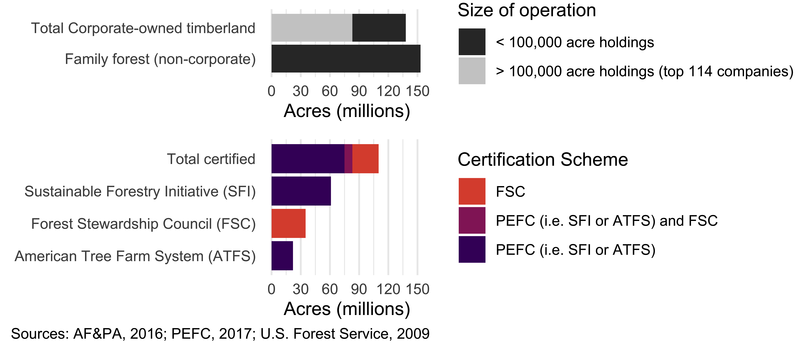
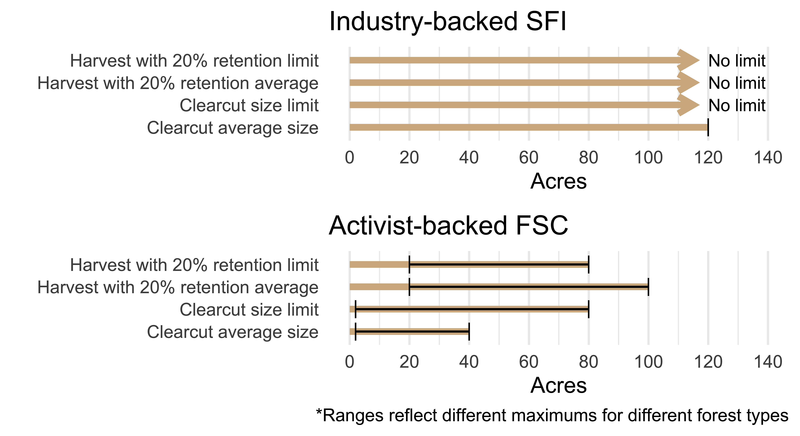
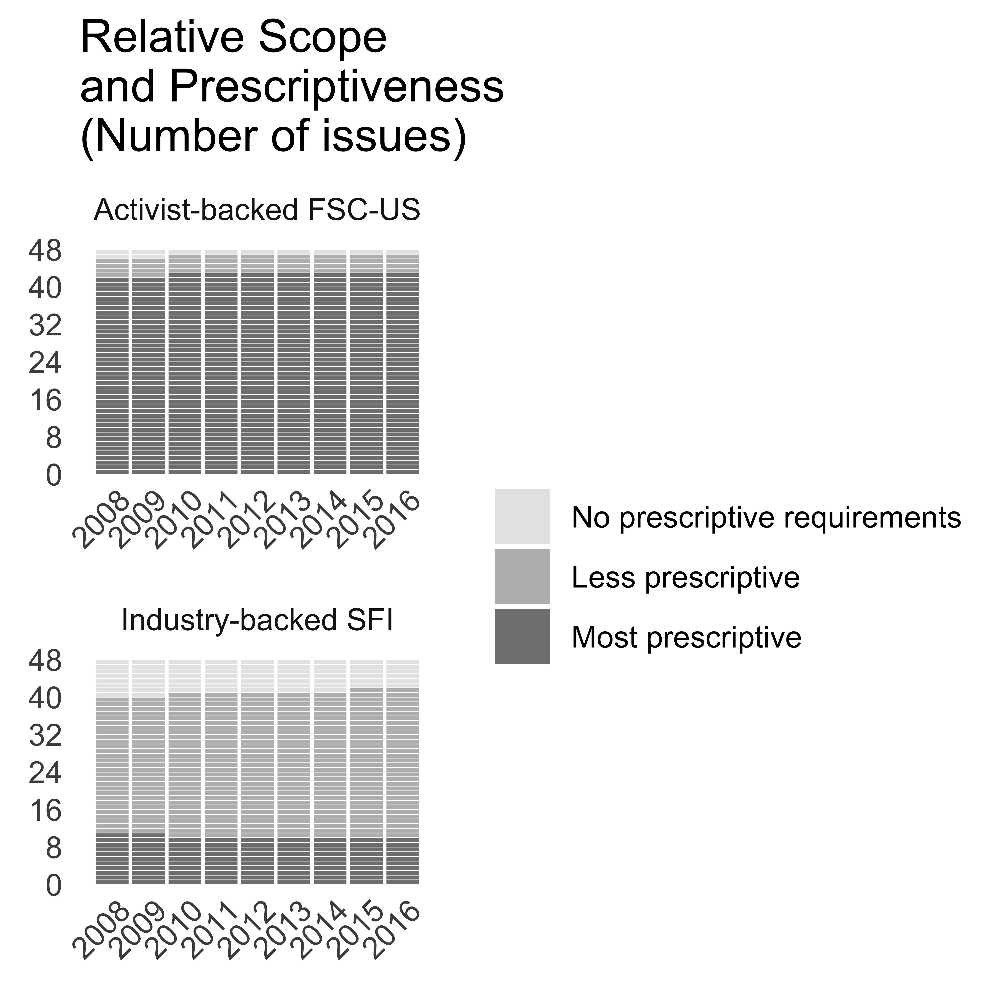
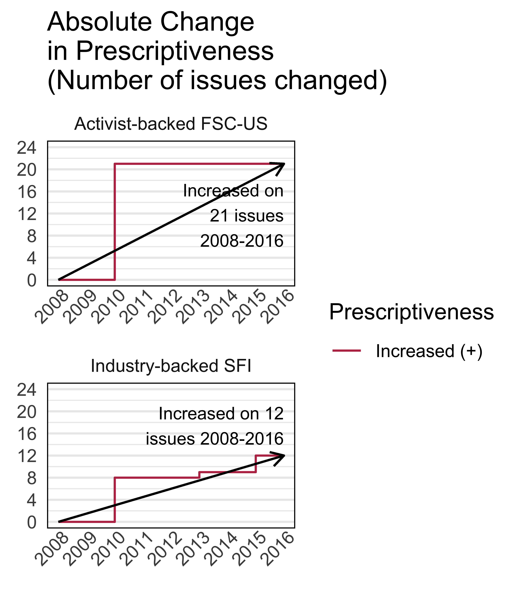

```{r setup, include = FALSE}
# chunks options:
# hide code and messages by default (warning, message)
# cache everything 
knitr::opts_chunk$set(warning = FALSE, 
                      message = FALSE,
                      echo = FALSE, 
                      cache = FALSE, 
                      fig.align = 'center',
                      fig.retina = 2,
                      dpi = 100)
# Xaringan: https://slides.yihui.name/xaringan/
library("xaringan")
library("xaringanthemer")
library("here")


mono_light(base_color = "#3b444b",
          link_color = "#B7E4CF",
          #background_color = "#FAF0E6", # linen
          header_font_google = google_font("PT Sans"), 
          text_font_google = google_font("Old Standard"), 
          text_font_size = "28px",
          padding = "10px",
          code_font_google = google_font("Inconsolata"), 
          code_inline_background_color    = "#F5F5F5", 
          table_row_even_background_color = "#ddede5",
          extra_css = 
            list(".remark-slide-number" = list("display" = "none")))

```

```{r, eval = FALSE, include= FALSE}
# setup
devtools::install_github("yihui/xaringan")
devtools::install_github("gadenbuie/xaringanthemer")
install.packages("webshot")
# webshot::install_phantomjs()

# export to pdf
file <- here::here("pres.html")
webshot::webshot(file, "fsc-sfi-pres.pdf")
```

## We set out to clear up confusion: 

## Do competing private governance initiatives “race to the bottom,” “ratchet up,” “converge,” or “diverge” over time?

--

## We found that disagreements were often rooted in different concepts of regulatory stringency. 

???

Many assumed that different claims about which standard was higher and lower, converging or not over time, resulted from the biases of those making the claims.

While certainly true, this is not the whole story. Good scholars had come to different conclusions. 

We found that different findings were often rooted in different concepts of regulatory stringency. 

Different studies were coming to different conclusions because they had different ways of measuring the dependent variable, regulatory stringency. Different ways of assessing which program is "higher" or "raising standards" or "converging."

---

## To remedy this, we offer a framework for more systematic comparisons across programs and over time. 

Building on public policy scholarship, we distinguish three often-conflated measures of stringency: regulatory scope, prescriptiveness, and performance levels. 


???

We propose that scholars should assess the prescriptiveness and policy settings of each of a comprehensive set of possible issues a program might cover. This means asking the "issue-level" questions we pose on the right side of this table for each issue that may be covered by existing and proposed programs one might want to compare). This is a lot of work, and not all researchers may be able to do so. This is ok; Studies with a more limited scope can still be put in conversation with other studies as long as they are all clear about their scope. 

However, there is a critical advantage to a comprehensive analysis.

A comprehensive approach allows us to assess regulatory scope and prescriptiveness at the *program level* (the left side of the table):
- how comprehensive is the scope relative to the full set of 48 issues
- what portion of issues have prescriptive requirements

There are other dimensions of regulatory stringency, like the rigorousness of auditing processes and enforcement, which are outside of the scope of this paper. We focus on the written substantive requirements. 

To show what applying this framework looks like, we apply it to the case of the competing forestry certification programs.

I am going to review the results for the US: FSC-US and SFI, but in the paper, we also assess PEFC and FSC Principles and Criteria. 

---

# Case study: Comparing competing U.S. forestry certification programs

- One founded by environmental groups (FSC), the other by the national industry association (SFI)

```{r, fig.show = "hold", out.width = "100%"}

knitr::include_graphics("images/fscwood.jpg")  
```

???

Sustainable Forestry initiative was founded by the American Paper and Forest Products Association as a more industry-friendly alternative to the FSC. 

---

## Regulating foresty in the U.S.

Competing certification regimes play a major role in regulating the U.S. forestry industry, regulating a third of commercially harvested timberland, including most corporate-owned timberland. <!--Audits often assess compliance with public laws beyond certification requirements.-->

```{r, fig.show = "hold", out.width = "100%"}

  
```

???

These programs play a major role in regulating forestry, covering much more of the sector than USDA Organic certification for farmland, for example. 

---

class: inverse center

# The politics of governing through market power

(versus or along-side public policy)

???

I want to take 1 minute for a very brief overview of what I mean when I say private authority. 

As with public policy, requirements can be voluntary, but the lack of government regulation does not just mean businesses regulating themselves.

What I mean is that some authority other than the government exists that has the power to regulate an industry; in this case, the authority to regulate an industry's practices is rooted in market power. Buyers demand that products that meet certain requirements, the body that sets those requirements has the power to regulate the practices of producers.

---

Private Authority, Act 1: Organizing for change in commodity production

```{r, fig.show = "hold", out.width = "100%"}

  
```

---

Private Authority, Act 2: Demand for certified product

```{r, fig.show = "hold", out.width = "75%"}

  
```

---

Private Authority, Act 3: Governing, i.e., changing requirements over time

```{r, fig.show = "hold", out.width = "100%"}

  
  

```

---

## Comparing forest certification programs

We compare each program's stringency on 48 key social and environmental issues from 2008-2016. For example, as of 2016, the FSC-US and SFI had different limits on the size of clearcuts: 

```{r, fig.show = "hold", out.width = "80%"}

  
```


---

Another key issue: limits on harvesting near streams

```{r, fig.show = "hold", out.width = "75%"}

knitr::include_graphics("Figs/riparian-1.png")  
```

---

<!--

### Qualitative comparison of selected policy settings


|  Issue  |  Activist-backed FSC-US  |  Industry-backed SFI  |
|:------------------------|:--------------------------------------------|:--------------------------------------------|
|Indigenous peoples' rights | Recognize and uphold rights, customs, culture, including UNDRIP. No threat to rights or resources. Free, prior, and informed consent on public and private lands. Engage indigenous peoples and consult with affected groups. Cooperate to identify and protect significant sites. Compensate for indigenous knowledge and utilize as requested. | A written policy acknowledging a commitment to recognize and respect rights. |
|Public Reporting and Consultation | Required on public and private lands. | Required on public lands. | 
|Forest conversion to non-forest | Prohibited except limited areas where clear, substantial, additional, secure, long-term conservation benefits. | No specific policy.| 
|Old growth forest | Old growth is normally mapped as conservation forest—only restoration management on public land. Legacy trees are not harvested. Maintain structure, composition, and processes. A portion of the forest is restored where old-growth would naturally occur. | Support and participate in programs for old-growth conservation---no identification or restoration requirements.
|Protected areas | Conserve or restore a representative area of natural ecosystems. Assess and maintain environmental values and necessary conservation measures. | No specific policy.|
|Threatened and Endangered Species | Survey and report or assume vulnerable and imperiled species are present. Maintain habitat & viable populations. | Program to protect threatened and endangered species at known sites. Protect viable populations of imperiled species.|
|Workers' right to organize | Workers are free to associate and advocate. Develop dispute resolution. | Obey laws. Train on worker rights. |
|Wages | Written commitment to comply with social law prevailing wage. | Train on wage rules. |
|Safety | Safety guidelines posted. Contracts include safety. Records kept. | Written commitment to comply with OSHA. Training on OSHA |


--->


### Types of Stringency


--

Policy Prescriptiveness


???

We assess the prescriptiveness and policy settings of each of the 48 key issues identified in the US green building council report. This comprehensive approach allows us to assess regulatory scope and prescriptiveness at the program level:
- how comprehensive is the scope relative to the full set of 48 issues
- what portion of issues have prescriptive requirements

---

### Possible Patterns of Relative Change 

(in each type of regulatory stringency)

```{r, fig.show = "hold", out.width = "100%"}

  
```

*The two arrows in each cell represent two programs. A comparison of three programs would have three arrows.
---

Overall, we find **"equilibrium" in policy scope**: neither program significantly changed the scope of issues it addressed.

```{r, fig.show = "hold", out.width = "60%"}

  
```

????

Scope of bother programs stayed relatively constant, and if we just look at the darker and middle grey bars, issues where there were some requirements, the two programs have a very similar scope. 

The industry-backed SFI program often contained language similar to that of the activist-backed FSC-US program (i.e., it was similar in scope) but often lacked (costlier) mandatory performance thresholds (i.e., the requirements were less prescriptive--the dark grey bars). This result suggests that any effort to test theories related to compliance cost or differentiation must distinguish between measures of stringency based on policy scope or prescriptiveness.

There we some changes: 
Both programs did begin regulating carbon emissions in 2010, but it is unclear if this change in scope is one program reacting to the other or both programs responding to a third causal variable.

---

Overall, we find **"upwardly divergent" policy prescriptiveness**: both programs increased in prescriptiveness, but this increase was greater for the activist-backed FSC-US program. 


```{r, fig.show = "hold", out.width = "50%"}

  
```

???

Unlike scope, there were quite a few changes in prescriptiveness. The FSC-US standard contained a great deal more requirements than the national template had. SFI made a series of smaller revisions, also increasing prescriptiveness but at a lower rate. 

---

Overall assessments of **policy settings** are tricky, as most can only be compared qualitatively (see the paper!) and thus can't be aggregated.

--

# One pattern: requirements added by the activist-backed program were more likely to impose costs on firms than requirements added by the industry-backed program, many of which may even benefit firms. 

<!--

### Why does SFI address many of the same issues as FSC but with less prescriptive requirements?

- Certification programs provide individual firms with a service, a signal of “social responsibility” that requires a credible third party.

--

### Why is SFI more prescriptive on some issues?

- Industry-backed certification programs also provide a mechanism for an industry to improve its collective reputation and capacity by coordinating contributions to collective goods.


-->

---

class: inverse

# Thank you! 

## Slides, paper, & more: [judgelord.github.io/FSC-SFI](https://judgelord.github.io/FSC-SFI)

```{r, fig.show = "hold", out.width = "60%"}

knitr::include_graphics("Figs/FSC-SFI-1.png")  
```