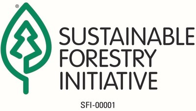
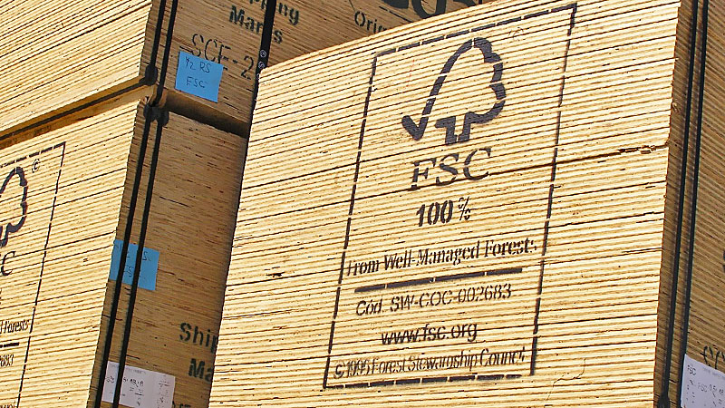

```{r setup, include=FALSE}
source(here::here("setup.R"))

load(here("data/SFIvFSC.Rdata"))
```

--- 

**Abstract**

Scholars present conflicting accounts of change in private regulations, including whether competing programs “race to the bottom,” “ratchet up,” “converge,” or “diverge.” We find this to be a symptom of inconsistent measures of regulatory stringency. To remedy this, we offer a framework to distinguish three often-conflated measures: policy scope, prescriptiveness, and performance levels. Using our framework, we compare two leading U.S. forestry certification programs, revealing an upward but divergent pattern in policy prescriptiveness. The program founded by activists generally added requirements that impose costs on firms, while the program established by the American Forest & Paper Association generally added requirements that benefit the sector. This is consistent with our hypothesis that industry-backed programs target less costly types of regulatory stringency than activist-backed programs. We also find several more nuanced patterns of change that previous scholarship failed to anticipate, illustrating how disentangling types of stringency can improve theory building and testing,

---

## Context: Regulating foresty in the U.S.

Competing certification regimes, the Forest Stewardship Council (FSC) and The Sustainable Forestry Initiative (SFI), play a major role in regulating the forestry industry in the United States, regulating a third of commercially harvested timberland including most corporate-owned timberland.


 
 


### U.S. Timberland by ownership and certification scheme
```{r acres, fig.height= 2.9, fig.width=6.7}

acres <- read.csv(here("data/acres.csv"))

acres$color <- gsub("FSC and PEFC \\(i.e. SFI or ATFS\\)", "PEFC (i.e. SFI or ATFS) and FSC", acres$color)

acres$color <- gsub("Corporate", "coporate", acres$color)

acres$color %<>% as.factor()
acres$color %<>% fct_relevel("FSC", "PEFC (i.e. SFI or ATFS) and FSC")
# "> 100,000 acre holdings (top 114 companies)", 

 
 # acres (witout family forests )
 cert <- ggplot(acres %>% filter(bar != "Total Corporate-owned timberland",
                                  bar != "Family forest (managed)",
                                  bar != "Family forest (non-corporate)",
                                  bar != "Family forest (unmanaged)")) + 
    geom_col(aes(y = Acres, x = bar, fill = color)) + 
   geom_vline(xintercept =seq(10, 150, 10), color="white", lwd=1) +
    coord_flip() + 
    labs(y = "Acres (millions)", x = "", fill = "Certification Scheme",
         caption = "Sources: AF&PA, 2016; PEFC, 2017; U.S. Forest Service, 2009") + 
    scale_fill_viridis_d(begin = .6, end = .2, option = "B") +
    scale_y_continuous(breaks = seq(0, 150, 30), limits = c(0,155)) +
     theme_minimal() +
    theme(axis.title.y = element_blank(),
          legend.background = element_blank(),
          panel.grid.minor.y = element_blank(),
          panel.grid.major.y = element_blank(),
          #change axis ticks thickness
          axis.ticks.y=element_blank())  
 
corp <- ggplot(acres %>% filter(bar %in% c("Total Corporate-owned timberland",
                                  #"Family Forest (Managed)",
                                  "Family forest (non-corporate)")))+
    geom_col(aes(y = Acres, x = bar, fill = color) ) + 
    coord_flip() + 
    labs(y = "Acres (millions)", x = "",
         fill = "Size of operation") + 
    scale_y_continuous(breaks = seq(0, 150, 30), limits = c(0,155)) +
  scale_fill_grey() + 
      # scale_fill_viridis_d(begin = .8, end = .4, option = "D") +

    theme(axis.ticks.x = element_blank(),
                    panel.grid.minor.y = element_blank(),
          panel.grid.major.y = element_blank(),
          #change axis ticks thickness
          axis.ticks.y=element_blank())  
 
 #grid.newpage()
  grid.draw(egg::ggarrange(corp, cert, 
                           ncol = 1,
                           #common.legend = T,
                           #legend = "right",
                           heights = c(.5, 1))) 
```


--- 

## Comparing Forest Certification Programs

We each program's stringency on 48 key social and environmental issues. For example, the FSC and SFI have different limits on the size of clearcuts and harvesting buffers arround streams. 

### Limits on clearcut size
```{r clearcuts, fig.height=3, fig.width=5.5}
d <- read_csv("data/clearcuts.csv")

fsc <- d %>% 
  filter(program %in% c("FSC"),
         !criteria %in% c("Overall focus", "Adjecent timber minimum age")) %>% 
  ggplot(aes(x = criteria, ymin= min, ymax=max, label = text, group = 1)) + 
  geom_col( aes(y = max), width = .3, fill = "tan") +
  #   geom_point( aes(y = 10), color="white", shape = "|")+
  # geom_point( aes(y = 20), color="white", shape = "|")+
  #   geom_point( aes(y = 30), color="white", shape = "|")+
  #   geom_point( aes(y = 40), color="white", shape = "|")+
  #   geom_point( aes(y = 50), color="white", shape = "|")+
  #   geom_point( aes(y = 60), color="white", shape = "|")+
  #   geom_point( aes(y = 70), color="white", shape = "|")+
  #   geom_point( aes(y = 80), color="white", shape = "|")+
  #   geom_point( aes(y = 90), color="white", shape = "|")+
  #   geom_point( aes(y = 100), color="white", shape = "|")+
  #   geom_point( aes(y = 110), color="white", shape = "|")+
  # geom_point( aes(y = 120), color="white", shape = "|")+
  geom_point( aes(y = 140), shape = "")+
  geom_point( aes(y = min), shape = "|", size =3) + 
  geom_point( aes(y = max), shape = "|", size =3) + 
  geom_text( aes(y = 142), hjust = 0, size = 3) +
  geom_linerange()+
  coord_flip() + 
  scale_y_continuous(breaks = seq(0,140,20), limits = c(0,140)) +
  labs(x = "", 
       y = "Acres",
       title = "Activist-backed FSC",    
       caption = "*Ranges reflect different maximums for different forest types") +
  theme(strip.text.y = element_text(angle = 180),
        strip.placement = "outside",
        legend.position = "none",
        panel.grid.minor.y = element_blank(),
        panel.grid.major.y = element_blank())
#############################


# SFI
sfi <- d %>% 
  filter(program %in% c("SFI"),
         !criteria %in% c("Overall focus", "Adjecent timber minimum age")) %>% 
  ggplot(aes(x = criteria, ymin= min, ymax=max, label = text, group=1)) + 
  geom_col( aes(y = max), width = .3, fill = "tan") +
  geom_segment(aes(x = "Clearcut size limit", xend = "Clearcut size limit", y = 0, yend=115), size = 1.5, color = "tan", arrow = arrow(length = unit(0.4, "cm")), lineend = "butt", linejoin= "mitre") +
    geom_segment(aes(x = "Harvest with 20% retention average", xend = "Harvest with 20% retention average", y = 0, yend=115), size = 1.5, color = "tan", arrow = arrow(length = unit(0.4, "cm")), lineend = "butt", linejoin= "mitre") +
  geom_segment(aes(x = "Harvest with 20% retention limit", xend = "Harvest with 20% retention limit", y = 0, yend=115), size = 1.5, color = "tan", arrow = arrow(length = unit(0.4, "cm") ), lineend = "butt", linejoin= "mitre") +
  scale_color_identity() + 
  # geom_point( aes(y = 10), color="white", shape = "|")+
  # geom_point( aes(y = 20), color="white", shape = "|")+
  #   geom_point( aes(y = 30), color="white", shape = "|")+
  #   geom_point( aes(y = 40), color="white", shape = "|")+
  #   geom_point( aes(y = 50), color="white", shape = "|")+
  #   geom_point( aes(y = 60), color="white", shape = "|")+
  #   geom_point( aes(y = 70), color="white", shape = "|")+
  #   geom_point( aes(y = 80), color="white", shape = "|")+
  #   geom_point( aes(y = 90), color="white", shape = "|")+
  #   geom_point( aes(y = 100), color="white", shape = "|")+
  #   geom_point( aes(y = 110), color="white", shape = "|")+
  #   geom_point( aes(y = 120), color="white", shape = "|")+
  geom_point( aes(y = min), shape = "|", size = 3) + 
  geom_point( aes(y = max), shape = "|", size = 3) + 
  geom_text( aes(y = 120), hjust = 0, size = 3) +
  geom_linerange()+
  coord_flip() + 
  scale_y_continuous(breaks = seq(0,140,20), limits = c(0,140)) +
  labs(x = "", y = "Acres",
       title = "Industry-backed SFI") + 
  theme(strip.text.y = element_text(angle = 180),
        strip.placement = "outside",
        legend.position = "none",
        panel.grid.minor.y = element_blank(),
        panel.grid.major.y = element_blank())


grid.newpage()
grid.draw(egg::ggarrange(sfi, fsc, 
                         ncol = 1))
```

### Limits on harvesting near streams
```{r riparian, fig.height=7, fig.width=8}
d <- read_csv("data/riparian-buffers.csv") %>% 
  mutate(Criteria = glue("{criteria2} {criteria}", .na = "")) %>%
  mutate(Standard = glue("{program} {region}", .na = "")) %>%
  mutate(total = none+tree+group) %>%
  gather(none, tree, group, key = "type", value = "feet")

d$type %<>% factor(levels = c("group", "tree", "none") )
d$type %<>% fct_recode("Single trees only" = "tree",
                       "Limited groups of trees" = "group",
                       "No timber harvesting" = "none")

d$Criteria %<>% factor()
d$Criteria %<>% fct_reorder(d$feet)

fsc <- d %>% 
  filter(program %in% c("FSC-US", "FSC")) %>% 
  ggplot(aes(x = Criteria, y = feet, fill= type, label = text, group=1)) + 
  geom_col(position = "stack") + 
  # geom_text(y= 10, label = "|", color = "white")+
  #   geom_text(y= 20, label = "|", color = "white")+
  #   geom_text(y= 30, label = "|", color = "white")+
  #   geom_text(y= 40, label = "|", color = "white")+
  #   geom_text(y= 50, label = "|", color = "white")+
  #   geom_text(y= 60, label = "|", color = "white")+
  #   geom_text(y= 70, label = "|", color = "white")+
  #   geom_text(y= 80, label = "|", color = "white")+
  #   geom_text(y= 90, label = "|", color = "white")+
  #   geom_text(y= 100, label = "|", color = "white")+
  #   geom_text(y= 110, label = "|", color = "white")+
  #   geom_text(y= 120, label = "|", color = "white")+
  #   geom_text(y= 130, label = "|", color = "white")+
  #     geom_text(y= 140, label = "|", color = "white")+
  #     geom_text(y= 150, label = "|", color = "white")+
  #     geom_text(y= 160, label = "|", color = "white")+
   #    geom_text(y= 170, label = "|", color = "white")+
  # geom_text( aes(y=total, label = paste(total, "feet")), size =3, hjust = 0, color = "#458B00") +
  geom_text( aes(y = 0), hjust = 0, size = 3, color = "#458B00", check_overlap = T)+
  # align axis
    geom_text( aes(y = 170, x = 0, label = "") )+
  coord_flip() +
  labs(x = "", y = "Feet from stream", fill = "Minimum streamside
harvest buffer zones",
       title = "Activist-backed FSC")+
  scale_fill_viridis_d(begin = .9, end = .5, option = "B") +
  facet_grid(region ~., scales = "free", space = "free", switch = "y") +
  # theme_gray() +
  theme(strip.text.y = element_text(angle = 180),
        strip.placement = "outside",
        panel.grid.minor.y = element_blank(),
        panel.grid.major.y = element_blank())

sfi <- d %>% 
  filter(program %in% c("SFI", "PEFC")) %>% 
  ggplot(aes(x = Criteria, y = feet, fill= type, label = text, group=1)) + 
  geom_col(position = "stack") + 
  geom_text(aes(y = 0), hjust = 0, size = 3, color = "#458B00", check_overlap = T)+
    geom_text(aes(y = 170, x = 0), label = "" )+ # to get scale to match
  coord_flip() +
  labs(x = "", y = "", fill = "",
       title = "Industry-backed SFI & PEFC")+
  scale_fill_viridis_d(begin = .9, end = .5, option = "B") + 
  facet_grid(region ~., scales = "free", space = "free", switch = "y") +
  # scale_x_continuous(limits = c(0,150)) + 
  # theme_gray() +
  theme(strip.text.y = element_text(angle = 180),
        strip.placement = "outside",
        legend.position = "none",    
        axis.text.x = element_blank(),
        panel.grid.minor = element_blank(),
        panel.grid.major = element_blank())

grid.newpage()
grid.draw(egg::ggarrange(sfi, fsc,
                         ncol = 1,
                         #common.legend = T,
                         #legend = "right",
                         heights = c(.2, 2)))  


```


---

In addition to issue-by-issue comparisons, we use two measures of regulatory stringency that can be aggregated across issues: the scope of issues addressed and the prescriptiveness of requirements on each issue. 

### Policy Prescriptiveness


|  | Discretionary |  Non-discretionary | 
|:----|:----:|:----:|
| Procedural (plan- or systems-based) | Flexible | Somewhat prescriptive | 
| Substantive (e.g.  a policy threshold) | Flexible | Most prescriptive |

---


### Scope and Prescriptiveness of FSC-US and SFI 2008-2016

<center>
```{r FSC-SFI, fig.height= 10, fig.width=7.5}
SFIvFSCnetChange$Measure %<>% str_replace("Increased", "Increased (+)")


## line plot (line)
line <- SFIvFSCnetChange %>%
  filter(Program %in% c(
    "Activist-backed FSC-US", "Industry-backed SFI"),
      Measure == "Increased (+)") %>% 
  ggplot() + 
  geom_step(aes(x = Year, y = Change, linetype = Measure, color = Measure) ) +
      scale_color_viridis_d(begin = .5, end = .2, option = "B") +
  facet_grid(. ~ Program) + 
  geom_text(data = data.frame(Program = "Industry-backed SFI"), 
label = "Increased on 12
issues 2008-2016", x = 2016, y = 14, vjust = 0, hjust = 1, size = 3) + 
  geom_text(data = data.frame(Program = "Activist-backed FSC-US"), 
label = "Increased on
21 issues
2008-2016", x = 2016, y = 6, vjust = 0, hjust = 1, size = 3) + 
  labs(title = "Absolute Change in Prescriptiveness",
       y = "Number of issues changed",
       color = "Prescriptiveness", linetype = "Prescriptiveness") + 
  scale_y_continuous(breaks = seq(0,48, by = 4)) + 
  scale_x_continuous(breaks = seq(2008,2016, by = 1)) + 
  #scale_linetype_discrete(name = "Change in Prescriptiveness") + 
  theme(#panel.grid.major = element_blank(), 
    #strip.text.x = element_blank(),
    #remove legend title
    # legend.title=element_blank(),
    #legend.key.width=grid::unit(0.2,"cm"),
    axis.title.x = element_blank(),
    axis.title.y = element_text(angle = 0),
    #change axis ticks thickness
    axis.ticks.x=element_blank(),
    # horizontal y
    #axis.title.y=element_text(angle = 0),
    # or blank y
    #axis.text.x=element_blank()
    axis.text.x=element_text(angle = 45, vjust = 1.3, hjust = 1),
        panel.grid.minor.x = element_blank(),
        panel.grid.major.x = element_blank())
# line

SFIvFSC$Prescriptiveness %<>% fct_recode("Less prescriptive" = "Some prescriptive requirements")

# bar plot (bar)
bar <- SFIvFSC %>%
  filter(Program %in% c("Activist-backed FSC-US", "Industry-backed SFI")) %>% 
  ggplot() + 
  geom_bar(aes(x = Year, fill = Prescriptiveness), position = "stack") +
  geom_hline(yintercept =seq(0,48, by = 1), color="white", lwd = .1) +  scale_fill_grey(start = .9, end = .5) + 
  facet_grid(. ~ Program) + 
  # geom_segment(data = data.frame(Program = "Activist-backed FSC-US"), aes(x = 2007.5, y = 42, xend = 2009.5, yend = 42), linetype = 1, size = .5) + 
  # geom_segment(data = data.frame(Program = "Activist-backed FSC-US"), aes(x = 2015.5, y = 43, xend = 2016.5, yend = 43), linetype = 1, size = .5) + 
  # geom_segment(data = data.frame(Program = "Industry-backed SFI"), aes(x = 2007.5, y = 11, xend = 2009.5, yend = 11), linetype = 1, size = .5) + 
  # geom_segment(data = data.frame(Program = "Industry-backed SFI"), aes(x = 2015.5, y = 10, xend = 2016.5, yend = 10), linetype = 1, size = .5) + 
  # geom_text(data = data.frame(Program = "Industry-backed SFI"), label = "As prescriptive or more on 10 issues", x = 2016, y = 12, vjust = 0, hjust = 1, size = 3) + 
  # geom_text(data = data.frame(Program = "Activist-backed FSC-US"), label = "As prescriptive or more on 43 issues", x = 2016, y = 28, vjust = 0, hjust = 1, size = 3) + 
  labs(title = "Relative Prescriptiveness",
       y = "Number of issues covered") + 
  scale_y_continuous(breaks = seq(0,48, by = 8)) +
  scale_x_continuous(breaks = seq(2008,2016, by = 1), labels = rep('↑', 9)) +
  theme(#legend.position="none",
        panel.grid.major = element_blank(), 
        panel.grid.minor = element_blank(),
        #remove legend title
        legend.title=element_blank(),
        #set a slim legend
        # legend.key.width=grid::unit(0.2,"cm"),
        # axis.title.y = element_blank(),
        #change axis ticks thickness
        axis.ticks.x=element_blank(),
        # axis.text.x=element_text(angle = 45, vjust = 1.3, hjust = 1),
        axis.title.x=element_blank(),
        axis.title.y = element_text(angle = 0),
        #strip.text.x = element_blank(),
        strip.background = element_blank())
# bar

# tile plot (tile)
tile <- SFIvFSC %>% 
  ungroup() %>%
  filter(Program %in% c("Activist-backed FSC-US", "Industry-backed SFI")) %>%
ggplot() +
aes(x = Year, y = Issue) + 
  facet_grid(. ~ Program)   + 
  geom_tile(aes(fill = Prescriptiveness), color = "white",  show.legend =FALSE) + 
  scale_fill_grey(start = .9, end = .5) + 
  scale_color_viridis_d(option = "B") + 
  geom_point(aes(shape = Change, color = Change), size = 5) +
  scale_shape_manual(values=c("-", "+", ""))+
  scale_y_discrete(limits = rev(levels(SFIvFSC$Issue))) +
  scale_x_continuous(breaks = seq(2008,2016, by = 1)) + 
  #labs(title = "Scope of Key Issues covered") + 
  # geom_point(data = data %>% filter(Program %in% c("Activist-backed FSC-US", "Industry-backed SFI"), Change %in% c("Became less prescriptive", "Became more prescriptive")), aes(shape = Change))  +
  theme(panel.grid.major = element_blank(), 
        panel.grid.minor = element_blank(),
        #remove legend title
        legend.title=element_blank(),
        #set a slim legend
        # legend.key.width=grid::unit(0.2,"cm"),
        axis.title = element_blank(),
        #change axis ticks thickness
        axis.ticks=element_blank(),
        axis.text.x=element_text(angle = 45, vjust = 1.3, hjust = 1),
        # axis.text.x=element_blank(),
        strip.background = element_blank(),
        strip.text.x = element_blank())
# tile

grid.newpage()
grid.draw(egg::ggarrange(bar, tile, line,
                         ncol = 1, nrow = 3,
                         #common.legend = T,
                         #legend = "right",
                         heights = c(.4, 2, .4)))   
```


--- 

### Scope and Prescriptiveness of FSC P&C and PEFC 2008-2015


```{r FSC-PEFC, fig.height= 10, fig.width=7.5}
PEFCvFSC$Measure %<>% str_replace("Increased", "Increased (+)")

# line plot (line)
line <- PEFCvFSC %>% 
  mutate(Change = Change08) %>% 
  filter(Program %in% c( "Activist-backed FSC P&C", "Industry-backed PEFC"),
  Measure == "Increased (+)") %>% 
  ggplot() + 
  geom_step(aes(x = Year, y = Change08, linetype = Measure, color = Measure)) + 
        scale_color_viridis_d(begin = .5, end = .2, option = "B") +
  facet_grid(. ~ Program) + 
  geom_text(data = data.frame(Program = "Industry-backed PEFC"), 
label = "Increased on
18 issues 
2008-2015", x = 2015, y = 16, vjust = 1, hjust = 1, size = 3) + 
  geom_text(data = data.frame(Program = "Activist-backed FSC P&C"),
label = "Increased on 13
issues 2008-2015", x = 2015, y = 18, vjust = 1, hjust = 1, size = 3) + 
  labs(title = "Absolute Change in Prescriptiveness",
       y = "Number of issues changed",
       color = "Prescriptiveness", linetype = "Prescriptiveness") +
  scale_y_continuous(breaks = seq(0,48, by = 4)) + 
  scale_x_continuous(breaks = seq(2008,2015, by = 1)) + 
  #scale_linetype_discrete(name = "Change in Prescriptiveness") + 
  theme(#panel.grid.major = element_blank(), 
    #strip.text.x = element_blank(),
        #remove legend title
        # legend.title=element_blank(),
        #legend.key.width=grid::unit(0.2,"cm"),
        axis.title.x = element_blank(),
        #change axis ticks thickness
        axis.ticks.x=element_blank(),
        # horizontal y
        #axis.title.y=element_text(angle = 0),
        # or blank y
        axis.title.y = element_text(angle = 0),
        #axis.text.x=element_blank()
    axis.text.x=element_text(angle = 45, vjust = 1.3, hjust = 1),
        panel.grid.minor.x = element_blank(),
        panel.grid.major.x = element_blank())
# line

PEFCvFSC$Prescriptiveness %<>% fct_recode("Less prescriptive" = "Some prescriptive requirements")
# bar plot (bar)
bar <- filter(PEFCvFSC, Measure == "Increased (+)" & Program %in% c("Activist-backed FSC P&C", "Industry-backed PEFC" # "Activist-backed FSC-US", "Industry-backed SFI"
    )) %>% 
ggplot() + 
    geom_bar(aes(x = Year, fill = Prescriptiveness), width = 0.9) +
    geom_hline(yintercept =seq(0,48, by = 1), color="white", lwd = .1) +
  scale_fill_grey(start = .9, end = .5) + 
    facet_grid(. ~ Program) + # scale_color_grey() + scale_fill_grey() + scale_color_grey() +
    # geom_segment(data = data.frame(Program = "Activist-backed FSC P&C"), aes(x = 2007.5, y = 34, xend = 2011.5, yend = 34), linetype = 1, size = .5) + 
    # geom_segment(data = data.frame(Program = "Activist-backed FSC P&C"), aes(x = 2014.5, y = 36, xend = 2015.5, yend = 36), linetype = 1, size = .5) + 
    # geom_segment(data = data.frame(Program = "Industry-backed PEFC"), aes(x = 2007.5, y = 20, xend = 2009.5, yend = 20), linetype = 1, size = .5) + 
    # geom_segment(data = data.frame(Program = "Industry-backed PEFC"), aes(x = 2014.5, y = 27, xend = 2015.5, yend = 27), linetype = 1, size = .5) + 
    # geom_text(data = data.frame(Program = "Industry-backed PEFC"), label = "As prescriptive or more on 27 issues", x = 2015, y = 13, vjust = 0, hjust = 1, size = 3) + 
    # geom_text(data = data.frame(Program = "Activist-backed FSC P&C"), label = "As prescriptive or more on 36 issues", x = 2015, y = 20, vjust = 0, hjust = 1, size = 3) + 
    labs(title = "Relative Prescriptiveness",
         y = "Number of issues covered") + 
    scale_y_continuous(breaks = seq(0,48, by = 8)) + 
    scale_x_continuous(breaks = seq(2008,2015, by = 1), labels = rep('↑', 8)) +
  theme(# legend.position="none",
        panel.grid.major = element_blank(), 
        panel.grid.minor = element_blank(),
        #remove legend title
        legend.title=element_blank(),
        #set a slim legend
        # legend.key.width=grid::unit(0.2,"cm"),
        axis.title.x = element_blank(),
        axis.title.y = element_text(angle = 0),
        #change axis ticks thickness
        axis.ticks.x=element_blank(),
        #axis.text.x=element_text(angle = 45, vjust = 1.3, hjust = 1),
        #axis.text.x=element_blank(),
        #strip.text.x = element_blank(),
        strip.background = element_blank())
# bar

# tile plot (tile)
tile <- PEFCvFSC %>% filter(Program %in% c(
  #"Activist-backed FSC-US", "Industry-backed SFI"
  "Activist-backed FSC P&C", "Industry-backed PEFC"
  )) %>%
  ggplot( aes(x = Year, y = Issues) ) + 
  facet_grid(. ~ Program) + # scale_color_grey() + scale_fill_grey() + scale_color_grey() +
  geom_tile(aes(fill = Prescriptiveness), color = "white",  show.legend =FALSE) + 
      geom_point(aes(shape = Change, color = Change), size =5) +
      scale_shape_manual(values=c("-", "+", ""))+
      scale_fill_grey(start = .9, end = .5) + 
    scale_color_viridis_d(option = "B") +  
  scale_y_discrete(limits = rev(levels(PEFCvFSC$Issues))) +
  scale_x_continuous(breaks = seq(2008,2015, by = 1)) + 
#labs(title = "Scope of Issues covered") + 
  theme(panel.grid.major = element_blank(), 
        panel.grid.minor = element_blank(),
        #remove legend title
        legend.title=element_blank(),
        #set a slim legend
        # legend.key.width=grid::unit(0.2,"cm"),
        axis.title = element_blank(),
        #change axis ticks thickness
        axis.ticks=element_blank(),
        axis.text.x=element_text(angle = 45, vjust = 1.3, hjust = 1),
        # axis.text.x=element_blank(),
        strip.background = element_blank(),
        strip.text.x = element_blank())
# tile

grid.newpage()
grid.draw(egg::ggarrange(bar, tile, line, 
                    ncol = 1,
                    #common.legend = T,
                    #legend = "right",
                    heights = c(.4, 2, .4)))   
```

---

</center>
$$\require{HTML}$$


## Patterns of Change


|  | Converging | Parallell | Diverging |
|:----|:----:|:----:|:----:|
| Increasing | $\style{display: inline-block; transform: rotate(35deg)}{\nearrow}$  <br> $\nearrow$ | $\nearrow$ <br> $\nearrow$ | $\nearrow$ <br> $\style{display: inline-block; transform: rotate(35deg)}{\nearrow}$ |
| Opposing or Eqilibrium | $\searrow$ <br> $\nearrow$ | $\longrightarrow$ <br> $\longrightarrow$ | $\nearrow$ <br> $\searrow$ |
| Decreasing |$\searrow$ <br> $\style{display: inline-block; transform: rotate(-35deg)}{\searrow}$  | $\searrow$ <br> $\searrow$ | $\style{display: inline-block; transform: rotate(-35deg)}{\searrow}$  <br> $\searrow$ |

---

```{r FSC-SFI-data}
zeros <- issues %>%
  ungroup() %>% 
  select(pattern)  %>% 
  distinct()

zeros2 <- tibble(pattern = c("Downward parallell", "Downward divergence", "Opposing convergence"))

zeros %<>% full_join(zeros2) %>% 
  mutate(n = 0)
  
```

```{r 2010}
Issues <- issues %>% filter(Year == 2010) %>% group_by(pattern)  %>% select(pattern, Issue) %>% distinct() %>% mutate(issues = paste(Issue, collapse = ": ")) %>% group_by(pattern, issues) %>% tally() %>% arrange(-n) 

Issues %<>% full_join(filter(zeros, !pattern %in% Issues$pattern))

```


### 2010 Patterns of change in prescriptiveness among U.S. Forestry Certification Programs (FSC-US and SFI) on 48 Key Issues

Upwardly converging issues: `r Issues$issues[which(Issues$pattern =="Upward convergence")]`

Upward parallell issues: `r Issues$issues[which(Issues$pattern =="Upward parallell")]`

Upwardly diverging issues: `r Issues$issues[which(Issues$pattern =="Upward divergence")]`

Opposing diverging issues: `r Issues$issues[which(Issues$pattern =="Opposing divergence")]`

Downwardly converging issues: `r Issues$issues[which(Issues$pattern =="Downward convergence")]`


2010

| | Converging | Parallell | Diverging |
|:----|:----:|:----:|:----:|
| Increasing | `r Issues$n[which(Issues$pattern == "Upward convergence")]`  | `r Issues$n[which(Issues$pattern == "Upward parallell")]`   | `r Issues$n[which(Issues$pattern == "Upward divergence")]`  |
| Opposing or Eqilibrium | `r Issues$n[which(Issues$pattern == "Opposing convergence")]` | `r Issues$n[which(Issues$pattern == "Equilibrium")]` | `r Issues$n[which(Issues$pattern == "Opposing divergence")]` |
| Decreasing | `r Issues$n[which(Issues$pattern == "Downward convergence")]` | `r Issues$n[which(Issues$pattern == "Downward parallell")]` | `r Issues$n[which(Issues$pattern == "Downward divergence")]` |


---

2015
```{r 2015}
# Table
Issues <- issues %>% filter(Year == 2015) %>% group_by(pattern)  %>% select(pattern, Issue) %>% distinct() %>% mutate(issues = paste(Issue, collapse = ": ")) %>% group_by(pattern, issues) %>% tally() %>% arrange(-n)

Issues %<>% full_join(filter(zeros, !pattern %in% Issues$pattern))

```

|  | Converging | Parallell | Diverging |
|:----|:----:|:----:|:----:|
| Increasing | `r Issues$n[which(Issues$pattern == "Upward convergence")]` | `r Issues$n[which(Issues$pattern == "Upward parallell")]` | `r Issues$n[which(Issues$pattern == "Upward divergence")]` |
| Opposing or Eqilibrium | `r Issues$n[which(Issues$pattern == "Opposing convergence")]` | `r Issues$n[which(Issues$pattern == "Equilibrium")]` | `r Issues$n[which(Issues$pattern == "Opposing divergence")]` |
| Decreasing | `r Issues$n[which(Issues$pattern == "Downward convergence")]` | `r Issues$n[which(Issues$pattern == "Downward parallell")]` | `r Issues$n[which(Issues$pattern == "Downward divergence")]` |


### 2015 Patterns of change in prescriptiveness among U.S. Forestry Certification Programs (FSC-US and SFI) on 48 Key Issues

Upwardly converging issues: `r Issues$issues[which(Issues$pattern =="Upward convergence")]`


---

### Qualitative comparison of policy settings


|  Issue  |  Activist-backed FSC-US  |  Industry-backed SFI  |
|:------------------------|:--------------------------------------------|:--------------------------------------------|
|Indigenous peoples' rights | Recognize and uphold rights, customs, culture including UNDRIP. No threat to rights or resources. Free, prior, and informed consent on public and private lands. Engage indigenous peoples and consult with affected groups. Cooperate to identify and protect significant sites. Compensate for indigenous knowledge and utilize as requested. | A written policy acknowledging a commitment to recognize and respect rights. |
|Public Reporting and Consultation | Required on public and private lands. | Required on public lands. | 
|Forest conversion to non-forest | Prohibited except limited areas where clear, substantial, additional, secure, long-term conservation benefits. | No specific policy.| 
|Old growth forest | Old growth is normally mapped as conservation forest. Only restoration management on public land. Legacy trees not harvested. Maintain structure, composition, and processes. A portion of the forest is restored where old growth would naturally occur. | Support and participate in programs for old growth conservation in the region — no identification or restoration requirements.
|Protected areas | Conserve or restore a representative area of natural ecosystems. Assess and maintain environmental values and necessary conservation measures. | No specific policy.|
|Threatened and Endangered Species | Survey and report or assume the presence of vulnerable, imperiled, and critically imperiled. Maintain habitat & viable populations. | Program to protect threatened and endangered species and known sites. Protect viable occurrences of critically imperiled or imperiled species.|
|Workers' right to organize | Freedom to associate and advocate |
Develop dispute resolution. | Obey law. Train on worker rights. |
|Wages | Meets local norms | Written commitment to comply with social law prevailing wage. Train on wage rules. |
|Safety | posted safety guidelines, contracts include safety, records kept | Written commitment to comply with OSHA. Training on OSHA |
