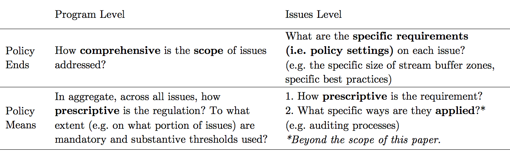

```{r setup, include=FALSE}
source(here::here("setup.R"))

load(here("data/SFIvFSC.Rdata"))
```


--- 

### Published in [*Organization & Environment*](https://journals.sagepub.com/doi/full/10.1177/1086026619853783). Download the paper [here](https://journals.sagepub.com/doi/10.1177/1086026619858874).

Get the Bibtex citation [here](https://judgelord.github.io/research/fsc-sfi/#)

If you are unable to download the paper, email Devin.JL@gmail.com.

**Abstract**

Due to inconsistent concepts of regulatory stringency, scholars offer conflicting accounts about whether competing private governance initiatives “race to the bottom,” “ratchet up,” “converge,” or “diverge.” To remedy this, we offer a framework for more systematic comparisons across programs and over time. We distinguish three often-conflated measures of stringency: regulatory scope, prescriptiveness, and performance levels. Applying this framework, we compare competing U.S. forestry certification programs, one founded by environmental activists and their allies, the other by the national industry association, the American Forest & Paper Association. We find ‘upwardly divergent’ policy prescriptiveness: both programs increased in prescriptiveness but this increase was greater for the activist-backed program. Furthermore, requirements added by the activist-backed program were more likely to impose costs on firms than requirements added by the industry-backed program, many of which may even benefit firms. These results are consistent with the hypothesis that industry-backed programs emphasize less costly types of stringency than activist-backed programs. They also reveal patterns of change that previous scholarship failed to anticipate, illustrating how disentangling types of stringency can improve theory building and testing.


---

## Context: Regulating foresty in the U.S.

Competing certification regimes, the Forest Stewardship Council (FSC) and The Sustainable Forestry Initiative (SFI), play a major role in regulating the forestry industry in the United States, regulating a third of commercially harvested timberland including most corporate-owned timberland.


 
 

---

### U.S. Timberland by ownership and certification scheme
```{r acres, fig.height= 2.9, fig.width=6.7, dpi=600, retina=1}

acres <- read.csv(here("data/acres.csv"))

acres$color <- gsub("FSC and PEFC \\(i.e. SFI or ATFS\\)", "PEFC (i.e. SFI or ATFS) and FSC", acres$color)

acres$color <- gsub("Corporate", "coporate", acres$color)

acres$color %<>% as.factor()
acres$color %<>% fct_relevel("FSC", "PEFC (i.e. SFI or ATFS) and FSC")
# "> 100,000 acre holdings (top 114 companies)", 

 
 # acres (witout family forests )
 cert <- ggplot(acres %>% filter(bar != "Total Corporate-owned timberland",
                                  bar != "Family forest (managed)",
                                  bar != "Family forest (non-corporate)",
                                  bar != "Family forest (unmanaged)")) + 
    geom_col(aes(y = Acres, x = bar, fill = color)) + 
   geom_vline(xintercept =seq(10, 150, 10), color="white", lwd=1) +
    coord_flip() + 
    labs(y = "Acres (millions)", x = "", fill = "Certification Scheme",
         caption = "Sources: AF&PA, 2016; PEFC, 2017; U.S. Forest Service, 2009") + 
    scale_fill_viridis_d(begin = .6, end = .2, option = "B") +
    scale_y_continuous(breaks = seq(0, 150, 30), limits = c(0,155)) +
     theme_minimal() +
    theme(axis.title.y = element_blank(),
          legend.background = element_blank(),
          panel.grid.minor.y = element_blank(),
          panel.grid.major.y = element_blank(),
          #change axis ticks thickness
          axis.ticks.y=element_blank())  
 
corp <- ggplot(acres %>% filter(bar %in% c("Total Corporate-owned timberland",
                                  #"Family Forest (Managed)",
                                  "Family forest (non-corporate)")))+
    geom_col(aes(y = Acres, x = bar, fill = color) ) + 
    coord_flip() + 
    labs(y = "Acres (millions)", x = "",
         fill = "Size of operation") + 
    scale_y_continuous(breaks = seq(0, 150, 30), limits = c(0,155)) +
  scale_fill_grey() + 
      # scale_fill_viridis_d(begin = .8, end = .4, option = "D") +

    theme(axis.ticks.x = element_blank(),
                    panel.grid.minor.y = element_blank(),
          panel.grid.major.y = element_blank(),
          #change axis ticks thickness
          axis.ticks.y=element_blank())  

 #grid.newpage()
  grid.draw(egg::ggarrange(corp, cert, 
                           ncol = 1,
                           #common.legend = T,
                           #legend = "right",
                           heights = c(.5, 1))) 
```


--- 

## Comparing Forest Certification Programs

We compare each program's stringency on 48 key social and environmental issues. For example, the FSC and SFI have different limits on the size of clearcuts and harvesting buffers around streams. 

### Limits on clearcut size
```{r clearcuts, fig.height=3, fig.width=5.5, dpi=600, retina=1}
d <- read_csv("data/clearcuts.csv")

fsc <- d %>% 
  filter(program %in% c("FSC"),
         !criteria %in% c("Overall focus", "Adjecent timber minimum age")) %>% 
  ggplot(aes(x = criteria, ymin= min, ymax=max, label = text, group = 1)) + 
  geom_col( aes(y = max), width = .3, fill = "tan") +
  geom_point( aes(y = 140), shape = "")+
  geom_point( aes(y = min), shape = "|", size =3) + 
  geom_point( aes(y = max), shape = "|", size =3) + 
  geom_text( aes(y = 142), hjust = 0, size = 3) +
  geom_linerange()+
  coord_flip() + 
  scale_y_continuous(breaks = seq(0,140,20), limits = c(0,140)) +
  labs(x = "", 
       y = "Acres",
       title = "Activist-backed FSC",    
       caption = "*Ranges reflect different maximums for different forest types") +
  theme(strip.text.y = element_text(angle = 180),
        strip.placement = "outside",
        legend.position = "none",
        panel.grid.minor.y = element_blank(),
        panel.grid.major.y = element_blank())
#############################


# SFI
sfi <- d %>% 
  filter(program %in% c("SFI"),
         !criteria %in% c("Overall focus", "Adjecent timber minimum age")) %>% 
  ggplot(aes(x = criteria, ymin= min, ymax=max, label = text, group=1)) + 
  geom_col( aes(y = max), width = .3, fill = "tan") +
  geom_segment(aes(x = "Clearcut size limit", xend = "Clearcut size limit", y = 0, yend=115), size = 1.5, color = "tan", arrow = arrow(length = unit(0.3, "cm")), lineend = "butt", linejoin= "mitre") +
    geom_segment(aes(x = "Harvest with 20% retention average", xend = "Harvest with 20% retention average", y = 0, yend=115), size = 1.5, color = "tan", arrow = arrow(length = unit(0.3, "cm")), lineend = "butt", linejoin= "mitre") +
  geom_segment(aes(x = "Harvest with 20% retention limit", xend = "Harvest with 20% retention limit", y = 0, yend=115), size = 1.5, color = "tan", arrow = arrow(length = unit(0.3, "cm") ), lineend = "butt", linejoin= "mitre") +
  scale_color_identity() + 
  # geom_point( aes(y = 10), color="white", shape = "|")+
  # geom_point( aes(y = 20), color="white", shape = "|")+
  #   geom_point( aes(y = 30), color="white", shape = "|")+
  #   geom_point( aes(y = 40), color="white", shape = "|")+
  #   geom_point( aes(y = 50), color="white", shape = "|")+
  #   geom_point( aes(y = 60), color="white", shape = "|")+
  #   geom_point( aes(y = 70), color="white", shape = "|")+
  #   geom_point( aes(y = 80), color="white", shape = "|")+
  #   geom_point( aes(y = 90), color="white", shape = "|")+
  #   geom_point( aes(y = 100), color="white", shape = "|")+
  #   geom_point( aes(y = 110), color="white", shape = "|")+
  #   geom_point( aes(y = 120), color="white", shape = "|")+
  geom_point( aes(y = min), shape = "|", size = 3) + 
  geom_point( aes(y = max), shape = "|", size = 3) + 
  geom_text( aes(y = 120), hjust = 0, size = 3) +
  geom_linerange()+
  coord_flip() + 
  scale_y_continuous(breaks = seq(0,140,20), limits = c(0,140)) +
  labs(x = "", y = "Acres",
       title = "Industry-backed SFI") + 
  theme(strip.text.y = element_text(angle = 180),
        strip.placement = "outside",
        legend.position = "none",
        panel.grid.minor.y = element_blank(),
        panel.grid.major.y = element_blank())


grid.newpage()
grid.draw(egg::ggarrange(sfi, fsc, 
                         ncol = 1))
```

### Limits on harvesting near streams
```{r riparian, fig.height=7, fig.width=8, dpi=600, retina=1}
d <- read_csv("data/riparian-buffers.csv") %>% 
  mutate(Criteria = glue("{criteria2} {criteria}", .na = "")) %>%
  mutate(Standard = glue("{program} {region}", .na = "")) %>%
  mutate(total = none+tree+group) %>%
  gather(none, tree, group, key = "type", value = "feet")

d$type %<>% factor(levels = c("group", "tree", "none") )
d$type %<>% fct_recode("Single trees only" = "tree",
                       "Limited groups of trees" = "group",
                       "No timber harvesting" = "none")

d$Criteria %<>% factor()
d$Criteria %<>% fct_reorder(d$feet)

fsc <- d %>% 
  filter(program %in% c("FSC-US", "FSC")) %>% 
  ggplot(aes(x = Criteria, y = feet, fill= type, label = text, group=1)) + 
  geom_col(position = "stack") + 
  # geom_text(y= 10, label = "|", color = "white")+
  #   geom_text(y= 20, label = "|", color = "white")+
  #   geom_text(y= 30, label = "|", color = "white")+
  #   geom_text(y= 40, label = "|", color = "white")+
  #   geom_text(y= 50, label = "|", color = "white")+
  #   geom_text(y= 60, label = "|", color = "white")+
  #   geom_text(y= 70, label = "|", color = "white")+
  #   geom_text(y= 80, label = "|", color = "white")+
  #   geom_text(y= 90, label = "|", color = "white")+
  #   geom_text(y= 100, label = "|", color = "white")+
  #   geom_text(y= 110, label = "|", color = "white")+
  #   geom_text(y= 120, label = "|", color = "white")+
  #   geom_text(y= 130, label = "|", color = "white")+
  #     geom_text(y= 140, label = "|", color = "white")+
  #     geom_text(y= 150, label = "|", color = "white")+
  #     geom_text(y= 160, label = "|", color = "white")+
   #    geom_text(y= 170, label = "|", color = "white")+
  # geom_text( aes(y=total, label = paste(total, "feet")), size =3, hjust = 0, color = "#458B00") +
  geom_text( aes(y = 0), hjust = 0, size = 3, color = "#458B00", check_overlap = T)+
  # align axis
    geom_text( aes(y = 170, x = 0, label = "") )+
  coord_flip() +
  labs(x = "", y = "Feet from stream", fill = "Minimum streamside
harvest buffer zones",
       title = "Activist-backed FSC")+
  scale_fill_viridis_d(begin = .9, end = .5, option = "B") +
  facet_grid(region ~., scales = "free", space = "free", switch = "y") +
  # theme_gray() +
  theme(strip.text.y = element_text(angle = 180),
        strip.placement = "outside",
        panel.grid.minor.y = element_blank(),
        panel.grid.major.y = element_blank())

sfi <- d %>% 
  filter(program %in% c("SFI", "PEFC")) %>%
  ggplot(aes(x = Criteria, y = feet, fill= type, label = text, group=1)) + 
  geom_col(position = "stack") + 
  geom_text(aes(y = 0), hjust = 0, size = 3, color = "#458B00", check_overlap = T)+
    geom_text(aes(y = 170, x = 0), label = "" )+ # to get scale to match
  coord_flip() +
  labs(x = "", y = "", fill = "",
       title = "Industry-backed SFI & PEFC")+
  scale_fill_viridis_d(begin = .9, end = .5, option = "B") + 
  #facet_grid(region ~., scales = "free", space = "free", switch = "y") +
  # scale_x_continuous(limits = c(0,150)) + 
  # theme_gray() +
  theme(strip.text.y = element_text(angle = 180),
        strip.placement = "outside",
        legend.position = "none",    
        axis.text.x = element_blank(),
        panel.grid.minor = element_blank(),
        panel.grid.major = element_blank())

grid.newpage()
grid.draw(egg::ggarrange(sfi, fsc,
                         ncol = 1,
                         #common.legend = T,
                         #legend = "right",
                         heights = c(.2, 2)))  


```

---

### Qualitative comparison of selected policy settings


|  Issue  |  Activist-backed FSC-US  |  Industry-backed SFI  |
|:------------------------|:--------------------------------------------|:--------------------------------------------|
|Indigenous peoples' rights | Recognize and uphold rights, customs, culture, including UNDRIP. No threat to rights or resources. Free, prior, and informed consent on public and private lands. Engage indigenous peoples and consult with affected groups. Cooperate to identify and protect significant sites. Compensate for indigenous knowledge and utilize as requested. | A written policy acknowledging a commitment to recognize and respect rights. |
|Public Reporting and Consultation | Required on public and private lands. | Required on public lands. | 
|Forest conversion to non-forest | Prohibited except limited areas where clear, substantial, additional, secure, long-term conservation benefits. | No specific policy.| 
|Old growth forest | Old growth is normally mapped as conservation forest. Only restoration management on public land. Legacy trees not harvested. Maintain structure, composition, and processes. A portion of the forest is restored where old growth would naturally occur. | Support and participate in programs for old growth conservation---no identification or restoration requirements.
|Protected areas | Conserve or restore a representative area of natural ecosystems. Assess and maintain environmental values and necessary conservation measures. | No specific policy.|
|Threatened and Endangered Species | Survey and report or assume vulnerable and imperiled species are present. Maintain habitat & viable populations. | Program to protect threatened and endangered species at known sites. Protect viable populations of imperiled species.|
|Workers' right to organize | Workers are free to associate and advocate. Develop dispute resolution. | Obey laws. Train on worker rights. |
|Wages | Written commitment to comply with social law prevailing wage. | Train on wage rules. |
|Safety | Safety guidelines posted. Contracts include safety. Records kept. | Written commitment to comply with OSHA. Training on OSHA |

---

In addition to issue-by-issue comparisons, we use two measures of regulatory stringency that can be aggregated across issues: the scope of issues addressed and the prescriptiveness of requirements on each issue. 

### Types of Stringency


### Policy Prescriptiveness

|  | Discretionary |  Non-discretionary | 
|:----|:----:|:----:|
| Procedural (plan- or systems-based) | Flexible | Somewhat prescriptive | 
| Substantive (e.g.  a policy threshold) | Flexible | Most prescriptive |

---


### Scope and Prescriptiveness of FSC-US and SFI 2008-2016

<center>
```{r FSC-SFI, fig.height= 10, fig.width=7.5, dpi=600, retina=1}
SFIvFSCnetChange$Measure %<>% str_replace("Increased", "Increased (+)") 

## line plot (line)
line <- SFIvFSCnetChange %>%
  filter(Program %in% c(
    "Activist-backed FSC-US", "Industry-backed SFI"),
      Measure == "Increased (+)") %>% 
  ggplot() + 
  geom_step(aes(x = Year, y = Change, linetype = Measure, color = Measure) ) +
      scale_color_viridis_d(begin = .5, end = .2, option = "B") +
  facet_grid(. ~ Program) + 
  geom_text(data = data.frame(Program = "Industry-backed SFI"), 
label = "Increased on 12
issues 2008-2016", x = 2016, y = 14, vjust = 0, hjust = 1, size = 3) + 
  geom_text(data = data.frame(Program = "Activist-backed FSC-US"), 
label = "Increased on
21 issues
2008-2016", x = 2016, y = 6, vjust = 0, hjust = 1, size = 3) + 
  labs(title = "Absolute Change in Prescriptiveness",
       y = "Number of issues changed",
       color = "Prescriptiveness", linetype = "Prescriptiveness") + 
  scale_y_continuous(breaks = seq(0,48, by = 4), limits=c(0,24)) + 
  scale_x_continuous(breaks = seq(2008,2016, by = 1)) + 
  #scale_linetype_discrete(name = "Change in Prescriptiveness") + 
  theme(#panel.grid.major = element_blank(), 
    #strip.text.x = element_blank(),
    #remove legend title
    # legend.title=element_blank(),
    #legend.key.width=grid::unit(0.2,"cm"),
    axis.title.x = element_blank(),
    axis.title.y = element_text(angle = 0),
    #change axis ticks thickness
    axis.ticks.x=element_blank(),
    # horizontal y
    #axis.title.y=element_text(angle = 0),
    # or blank y
    #axis.text.x=element_blank()
    axis.text.x=element_text(angle = 45, vjust = 1.3, hjust = 1),
        panel.grid.minor.x = element_blank(),
        panel.grid.major.x = element_blank())
# line

SFIvFSC$Prescriptiveness %<>% fct_recode("Less prescriptive" = "Some prescriptive requirements")

# bar plot (bar)
bar <- SFIvFSC %>%
  filter(Program %in% c("Activist-backed FSC-US", "Industry-backed SFI")) %>% 
  ggplot() + 
  geom_bar(aes(x = Year, fill = Prescriptiveness), position = "stack") +
  geom_hline(yintercept =seq(0,48, by = 1), color="white", lwd = .1) +  scale_fill_grey(start = .9, end = .5) + 
  facet_grid(. ~ Program) + 
  # geom_segment(data = data.frame(Program = "Activist-backed FSC-US"), aes(x = 2007.5, y = 42, xend = 2009.5, yend = 42), linetype = 1, size = .5) + 
  # geom_segment(data = data.frame(Program = "Activist-backed FSC-US"), aes(x = 2015.5, y = 43, xend = 2016.5, yend = 43), linetype = 1, size = .5) + 
  # geom_segment(data = data.frame(Program = "Industry-backed SFI"), aes(x = 2007.5, y = 11, xend = 2009.5, yend = 11), linetype = 1, size = .5) + 
  # geom_segment(data = data.frame(Program = "Industry-backed SFI"), aes(x = 2015.5, y = 10, xend = 2016.5, yend = 10), linetype = 1, size = .5) + 
  # geom_text(data = data.frame(Program = "Industry-backed SFI"), label = "As prescriptive or more on 10 issues", x = 2016, y = 12, vjust = 0, hjust = 1, size = 3) + 
  # geom_text(data = data.frame(Program = "Activist-backed FSC-US"), label = "As prescriptive or more on 43 issues", x = 2016, y = 28, vjust = 0, hjust = 1, size = 3) + 
  labs(title = "Relative Prescriptiveness",
       y = "Number of issues covered") + 
  scale_y_continuous(breaks = seq(0,48, by = 8)) +
  scale_x_continuous(breaks = seq(2008,2016, by = 1), labels = rep('↑', 9)) +
  theme(#legend.position="none",
        panel.grid.major = element_blank(), 
        panel.grid.minor = element_blank(),
        #remove legend title
        legend.title=element_blank(),
        #set a slim legend
        # legend.key.width=grid::unit(0.2,"cm"),
        # axis.title.y = element_blank(),
        #change axis ticks thickness
        axis.ticks.x=element_blank(),
        # axis.text.x=element_text(angle = 45, vjust = 1.3, hjust = 1),
        axis.title.x=element_blank(),
        axis.title.y = element_text(angle = 0),
        #strip.text.x = element_blank(),
        strip.background = element_blank())
# bar

# tile plot (tile)
tile <- SFIvFSC %>% 
  ungroup() %>%
  filter(Program %in% c("Activist-backed FSC-US", "Industry-backed SFI")) %>%
ggplot() +
aes(x = Year, y = Issue) + 
  facet_grid(. ~ Program)   + 
  geom_tile(aes(fill = Prescriptiveness), color = "white",  show.legend =FALSE) + 
  scale_fill_grey(start = .9, end = .5) + 
  scale_color_viridis_d(option = "B") + 
  geom_point(aes(shape = Change, color = Change), size = 5) +
  scale_shape_manual(values=c("-", "+", ""))+
  scale_y_discrete(limits = rev(levels(SFIvFSC$Issue))) +
  scale_x_continuous(breaks = seq(2008,2016, by = 1)) + 
  #labs(title = "Scope of Key Issues covered") + 
  # geom_point(data = data %>% filter(Program %in% c("Activist-backed FSC-US", "Industry-backed SFI"), Change %in% c("Became less prescriptive", "Became more prescriptive")), aes(shape = Change))  +
  theme(panel.grid.major = element_blank(), 
        panel.grid.minor = element_blank(),
        #remove legend title
        legend.title=element_blank(),
        #set a slim legend
        # legend.key.width=grid::unit(0.2,"cm"),
        axis.title = element_blank(),
        #change axis ticks thickness
        axis.ticks=element_blank(),
        axis.text.x=element_text(angle = 45, vjust = 1.3, hjust = 1),
        # axis.text.x=element_blank(),
        strip.background = element_blank(),
        strip.text.x = element_blank())
# tile

grid.newpage()
grid.draw(egg::ggarrange(bar, tile, line,
                         ncol = 1, nrow = 3,
                         #common.legend = T,
                         #legend = "right",
                         heights = c(.4, 2, .4)))   
```
</center>

The bottom panel of the above figure shows the trend in absolute prescriptiveness. Comparing the total number of increases in prescriptiveness is one way to measure rates of change. By this measure, the FSC-US increased stringency at a faster rate than the SFI from 2008 to 2016.
```{r FSC-SFI-trend, fig.width=3.5, fig.height=4, dpi=600, retina=1}
line + 
  geom_segment(aes(#color = Program, 
                   #linetype = Program,
                   x = 2008, y = 0, xend =2016, 
                   yend = ifelse(Program == "Activist-backed FSC-US", 21,12)), arrow = arrow(length = unit(0.1, "npc"))) + 
  theme(panel.border = element_rect(fill = NA)) + 
  facet_wrap("Program", ncol = 1, scales = "free_x") + 
  labs(title = "Absolute Change 
in Prescriptiveness
(Number of issues changed)",
y = "")
```

The top pannel in the above figure shows the trend in issue scope and relative prescriptiveness, which have stayed fairly constant from 2008 to 2016.
```{r FSC-SFI-bar, fig.width=4, fig.height=4, dpi=600, retina=1}
bar + 
  scale_x_continuous(breaks = seq(2008,2016, by = 1), labels = seq(2008,2016, by = 1))  + 
  theme(axis.text.x=element_text(angle = 45, vjust = 1.3, hjust = 1)) + 
  facet_wrap("Program", ncol = 1, scales = "free_x")  +
  labs(title = "Relative Scope 
and Prescriptiveness
(Number of issues)",
y = "")
```

Overall, each program had distinct areas in which its requirements were more prescriptive. For the FSC, these requirements tended to demand that forest operations “resemble natural processes” and “maintain ecosystem function.” This language appeared more frequently and forcefully in the 2010 standard concerning issues including clearcutting, riparian management, HCVFs, protected areas, old-growth forests, snags and downed wood, residual trees, genetic diversity, plantations, restoration, natural disturbance, non-timber forest products, soil protection, road building, and management planning. In contrast, the SFI was most prescriptive on issues such as material utilization, research, training, education, and public reporting and consultation.  The eight key issues on which the SFI increased prescriptiveness in 2010 also reflect the SFI’s focus on industry capacity and reputation. These included aesthetics, public reporting, education, training, and utilization. 

--- 

### Scope and Prescriptiveness of FSC P&C and PEFC 2008-2015

<center>

```{r FSC-PEFC, fig.height= 10, fig.width=7.5, dpi=600, retina=1}
PEFCvFSC$Measure %<>% str_replace("Increased", "Increased (+)") 

PEFCvFSC %<>% mutate(Change08 = ifelse(Year > 2011 & Program == "Activist-backed FSC P&C", 13, Change08))


# line plot (line)
line <- PEFCvFSC %>% 
  mutate(Change = Change08) %>% 
  filter(Program %in% c( "Activist-backed FSC P&C", "Industry-backed PEFC"),
  Measure == "Increased (+)") %>% 
  ggplot() + 
  geom_step(aes(x = Year, y = Change, linetype = Measure, color = Measure)) + 
        scale_color_viridis_d(begin = .5, end = .2, option = "B") +
  facet_grid(. ~ Program) + 
  geom_text(data = data.frame(Program = "Industry-backed PEFC"), 
label = "Increased on
18 issues 
2008-2015", x = 2015, y = 16, vjust = 1, hjust = 1, size = 3) + 
  geom_text(data = data.frame(Program = "Activist-backed FSC P&C"),
label = "Increased on 13
issues 2008-2015", x = 2015, y = 20, vjust = 1, hjust = 1, size = 3) + 
  labs(title = "Absolute Change in Prescriptiveness",
       y = "Number of issues changed",
       color = "Prescriptiveness", linetype = "Prescriptiveness") +
  scale_y_continuous(breaks = seq(0,48, by = 4), limits=c(0,24)) + 
  scale_x_continuous(breaks = seq(2008,2015, by = 1)) + 
  #scale_linetype_discrete(name = "Change in Prescriptiveness") + 
  theme(#panel.grid.major = element_blank(), 
    #strip.text.x = element_blank(),
        #remove legend title
        # legend.title=element_blank(),
        #legend.key.width=grid::unit(0.2,"cm"),
        axis.title.x = element_blank(),
        #change axis ticks thickness
        axis.ticks.x=element_blank(),
        # horizontal y
        #axis.title.y=element_text(angle = 0),
        # or blank y
        axis.title.y = element_text(angle = 0),
        #axis.text.x=element_blank()
    axis.text.x=element_text(angle = 45, vjust = 1.3, hjust = 1),
        panel.grid.minor.x = element_blank(),
        panel.grid.major.x = element_blank())
# line

PEFCvFSC$Prescriptiveness %<>% fct_recode("Less prescriptive" = "Some prescriptive requirements")
# bar plot (bar)
bar <- filter(PEFCvFSC, Measure == "Increased (+)" & Program %in% c("Activist-backed FSC P&C", "Industry-backed PEFC" # "Activist-backed FSC-US", "Industry-backed SFI"
    )) %>% 
ggplot() + 
    geom_bar(aes(x = Year, fill = Prescriptiveness), width = 0.9) +
    geom_hline(yintercept =seq(0,48, by = 1), color="white", lwd = .1) +
  scale_fill_grey(start = .9, end = .5) + 
    facet_grid(. ~ Program) + # scale_color_grey() + scale_fill_grey() + scale_color_grey() +
    # geom_segment(data = data.frame(Program = "Activist-backed FSC P&C"), aes(x = 2007.5, y = 34, xend = 2011.5, yend = 34), linetype = 1, size = .5) + 
    # geom_segment(data = data.frame(Program = "Activist-backed FSC P&C"), aes(x = 2014.5, y = 36, xend = 2015.5, yend = 36), linetype = 1, size = .5) + 
    # geom_segment(data = data.frame(Program = "Industry-backed PEFC"), aes(x = 2007.5, y = 20, xend = 2009.5, yend = 20), linetype = 1, size = .5) + 
    # geom_segment(data = data.frame(Program = "Industry-backed PEFC"), aes(x = 2014.5, y = 27, xend = 2015.5, yend = 27), linetype = 1, size = .5) + 
    # geom_text(data = data.frame(Program = "Industry-backed PEFC"), label = "As prescriptive or more on 27 issues", x = 2015, y = 13, vjust = 0, hjust = 1, size = 3) + 
    # geom_text(data = data.frame(Program = "Activist-backed FSC P&C"), label = "As prescriptive or more on 36 issues", x = 2015, y = 20, vjust = 0, hjust = 1, size = 3) + 
    labs(title = "Relative Prescriptiveness",
         y = "Number of issues covered") + 
    scale_y_continuous(breaks = seq(0,48, by = 8)) + 
    scale_x_continuous(breaks = seq(2008,2015, by = 1), labels = rep('↑', 8)) +
  theme(# legend.position="none",
        panel.grid.major = element_blank(), 
        panel.grid.minor = element_blank(),
        #remove legend title
        legend.title=element_blank(),
        #set a slim legend
        # legend.key.width=grid::unit(0.2,"cm"),
        axis.title.x = element_blank(),
        axis.title.y = element_text(angle = 0),
        #change axis ticks thickness
        axis.ticks.x=element_blank(),
        #axis.text.x=element_text(angle = 45, vjust = 1.3, hjust = 1),
        #axis.text.x=element_blank(),
        #strip.text.x = element_blank(),
        strip.background = element_blank())
# bar

# tile plot (tile)
tile <- PEFCvFSC %>% filter(Program %in% c(
  #"Activist-backed FSC-US", "Industry-backed SFI"
  "Activist-backed FSC P&C", "Industry-backed PEFC"
  )) %>%
  ggplot( aes(x = Year, y = Issues) ) + 
  facet_grid(. ~ Program) + # scale_color_grey() + scale_fill_grey() + scale_color_grey() +
  geom_tile(aes(fill = Prescriptiveness), color = "white",  show.legend =FALSE) + 
      geom_point(aes(shape = Change, color = Change), size =5) +
      scale_shape_manual(values=c("-", "+", ""))+
      scale_fill_grey(start = .9, end = .5) + 
    scale_color_viridis_d(option = "B") +  
  scale_y_discrete(limits = rev(levels(PEFCvFSC$Issues))) +
  scale_x_continuous(breaks = seq(2008,2015, by = 1)) + 
#labs(title = "Scope of Issues covered") + 
  theme(panel.grid.major = element_blank(), 
        panel.grid.minor = element_blank(),
        #remove legend title
        legend.title=element_blank(),
        #set a slim legend
        # legend.key.width=grid::unit(0.2,"cm"),
        axis.title = element_blank(),
        #change axis ticks thickness
        axis.ticks=element_blank(),
        axis.text.x=element_text(angle = 45, vjust = 1.3, hjust = 1),
        # axis.text.x=element_blank(),
        strip.background = element_blank(),
        strip.text.x = element_blank())
# tile

grid.newpage()
grid.draw(egg::ggarrange(bar, tile, line, 
                    ncol = 1,
                    #common.legend = T,
                    #legend = "right",
                    heights = c(.4, 2, .4)))   
```

</center>

The top pannel in the above figure shows the trend in issue scope and relative prescriptiveness, which have stayed fairly constant from 2008 to 2016.
```{r FSC-PEFC-bar, fig.width=4, fig.height=4, dpi=600, retina=1}
bar + 
  scale_x_continuous(breaks = seq(2008,2015, by = 1), labels = seq(2008,2015, by = 1))  + 
  theme(axis.text.x=element_text(angle = 45, vjust = 1.3, hjust = 1)) + 
  facet_wrap("Program", ncol = 1, scales = "free_x")  +
  labs(title = "Relative Scope 
and Prescriptiveness
(Number of issues)",
y = "")
```


The bottom panel of the above figure shows the trend in absolute prescriptiveness. By this measure, the PEFC increased stringency at a slightly faster rate than the FSC-P&C from 2008 to 2016.
```{r FSC-PEFC-trend, fig.width=3.5, fig.height=4, dpi=600, retina=1}
line + 
  geom_segment(aes(#color = Program, 
                   #linetype = Program,
                   x = 2008, y = 0, xend =2015, 
                   yend = ifelse(Program == "Activist-backed FSC P&C", 13,18)), arrow = arrow(length = unit(0.1, "npc"))) + 
  theme(panel.border = element_rect(fill = NA)) + 
  facet_wrap("Program", ncol = 1, scales = "free_x") + 
  labs(title = "Absolute Change 
in Prescriptiveness
(Number of issues changed)",
y = "")
```


Overall, while the PEFC added more requirements concerning indigenous rights and labor standards and came to cover a similar scope of issues to the FSC P&C, the FSC-P&C remained more prescriptive on social issues and significantly more prescriptive on ecological issues. Compared to the prescriptiveness of the FSC-US and SFI described below, the FSC–P&C and PEFC requirements exhibited more convergence on both scope and prescriptiveness, though many differences in policy settings remained.

---

$$\require{HTML}$$

## Patterns of Change

|  | Converging | Parallell | Diverging |
|:----|:----:|:----:|:----:|
| Increasing | $\style{display: inline-block; transform: rotate(35deg)}{\nearrow}$  <br> $\nearrow$ | $\nearrow$ <br> $\nearrow$ | $\nearrow$ <br> $\style{display: inline-block; transform: rotate(35deg)}{\nearrow}$ |
| Opposing or Eqilibrium | $\searrow$ <br> $\nearrow$ | $\longrightarrow$ <br> $\longrightarrow$ | $\nearrow$ <br> $\searrow$ |
| Decreasing |$\searrow$ <br> $\style{display: inline-block; transform: rotate(-35deg)}{\searrow}$  | $\searrow$ <br> $\searrow$ | $\style{display: inline-block; transform: rotate(-35deg)}{\searrow}$  <br> $\searrow$ |


---

```{r FSC-SFI-data}
zeros <- issues %>%
  ungroup() %>% 
  select(pattern)  %>% 
  distinct()

zeros2 <- tibble(pattern = c("Downward parallell", "Downward divergence", "Opposing convergence"))

zeros %<>% full_join(zeros2) %>% 
  mutate(n = 0)
  
```

```{r 2010}
Issues <- issues %>% filter(Year == 2010) %>% group_by(pattern)  %>% select(pattern, Issue) %>% distinct() %>% mutate(issues = paste(Issue, collapse = ": ")) %>% group_by(pattern, issues) %>% tally() %>% arrange(-n) 

Issues %<>% full_join(filter(zeros, !pattern %in% Issues$pattern))

```


### Patterns of change in prescriptiveness among U.S. Forestry Certification Programs (FSC-US and SFI) on 48 Key Issues


2010

| | Converging | Parallell | Diverging |
|:----|:----:|:----:|:----:|
| Increasing | `r Issues$n[which(Issues$pattern == "Upward convergence")]`  | `r Issues$n[which(Issues$pattern == "Upward parallell")]`   | `r Issues$n[which(Issues$pattern == "Upward divergence")]`  |
| Opposing or Eqilibrium | `r Issues$n[which(Issues$pattern == "Opposing convergence")]` | `r Issues$n[which(Issues$pattern == "Equilibrium")]` | `r Issues$n[which(Issues$pattern == "Opposing divergence")]` |
| Decreasing | `r Issues$n[which(Issues$pattern == "Downward convergence")]` | `r Issues$n[which(Issues$pattern == "Downward parallell")]` | `r Issues$n[which(Issues$pattern == "Downward divergence")]` |


Upwardly converging issues: `r Issues$issues[which(Issues$pattern =="Upward convergence")]`

Upward parallell issues: `r Issues$issues[which(Issues$pattern =="Upward parallell")]`

Upwardly diverging issues: `r Issues$issues[which(Issues$pattern =="Upward divergence")]`

Opposing diverging issues: `r Issues$issues[which(Issues$pattern =="Opposing divergence")]`

Downwardly converging issues: `r Issues$issues[which(Issues$pattern =="Downward convergence")]`


---

2015
```{r 2015}
# Table
Issues <- issues %>% filter(Year == 2015) %>% group_by(pattern)  %>% select(pattern, Issue) %>% distinct() %>% mutate(issues = paste(Issue, collapse = ": ")) %>% group_by(pattern, issues) %>% tally() %>% arrange(-n)

Issues %<>% full_join(filter(zeros, !pattern %in% Issues$pattern))

```

|  | Converging | Parallell | Diverging |
|:----|:----:|:----:|:----:|
| Increasing | `r Issues$n[which(Issues$pattern == "Upward convergence")]` | `r Issues$n[which(Issues$pattern == "Upward parallell")]` | `r Issues$n[which(Issues$pattern == "Upward divergence")]` |
| Opposing or Eqilibrium | `r Issues$n[which(Issues$pattern == "Opposing convergence")]` | `r Issues$n[which(Issues$pattern == "Equilibrium")]` | `r Issues$n[which(Issues$pattern == "Opposing divergence")]` |
| Decreasing | `r Issues$n[which(Issues$pattern == "Downward convergence")]` | `r Issues$n[which(Issues$pattern == "Downward parallell")]` | `r Issues$n[which(Issues$pattern == "Downward divergence")]` |


Upwardly converging issues: `r Issues$issues[which(Issues$pattern =="Upward convergence")]`

---

## Overall Comparison of SFI and FSC-US
By distinguishing different types of stringency, our framework improves upon blunt measures of “high” or “low” based on ambiguous concepts or only a few of the many issues a policy may address.
 
Overall, our results are consistent with the expectation that activist-backed programs have higher levels of more costly types of stringency. On ecological goals, the FSC-US standard was significantly more stringent than the SFI standard on both scope and prescriptiveness dimensions. On social goals, results are more mixed. On scope, the FSC-US standard protected land tenure and required that local communities benefit from harvesting in ways that were unmatched by SFI’s standard. 
Numerically, FSC-US covered a broader scope of social issues. On prescriptiveness, the contrast was more stark, with the FSC-US standard having significantly more prescriptive requirements on most social issues. On policy settings, the two programs had significant differences. On labor standards and indigenous rights, the FSC-US required higher wages and more attention to rights than did the SFI. In short, by the scope of issues addressed, by most qualitative comparisons, and certainly in terms of prescriptiveness, the FSC-US standard was more stringent than the SFI standard on social issues.
 
On more business-oriented goals such as efficiency (e.g., levels of cut tree utilization), industry capacity (e.g., workforce training and research), and industry reputation (e.g., public education and aesthetics), the overall patterns were largely reversed. SFI was slightly broader in scope (requiring contributions to research where FSC did not), was more prescriptive, and required higher performance levels on many business-friendly issues.
 
## Patterns of Change
In most years between 2008 and 2016, neither the FSC nor the SFI changed on any issue.
 
When they did change, upwardly diverging prescriptiveness was the most frequent pattern. Most changes for both programs occurred in 2010, where the overall pattern was divergence rather than convergence or stability. For all 16 issues on which only the FSC-US added requirements, the FSC-US already had the more prescriptive requirements, and almost all of these additions address ecological problems. Similarly, for three out of the four issues on which only the SFI added requirements, the SFI already had more prescriptive requirements.
 
The vast majority of changes (21 of 27 issues changed) fit a pattern where one program increased prescriptiveness while the other did not (or in one case, increased to a lesser degree), and the program that increased stringency *already had the more prescriptive requirements*. On 18 issues, the less prescriptive program stayed the same, leading to upward divergence. On three issues, the less prescriptive program decreased prescriptiveness, leading to opposing divergence.
 
Convergence was rare. In 2010, upward convergence only occurred when the FSC-US added requirements on the issue of “continual improvement” of harvesting operations, an issue usually associated more with the SFI. This outcome is interesting because scholars generally predict that less stringent private regulations will converge toward “benchmark” standards like FSC’s. Instead, we find the FSC-US ratcheting up prescriptiveness on an issue where its industry-backed competitor had more stringent requirements. Indeed, most studies overlook the possibility that industry-backed standards like the SFI may be more stringent on some issues and thus fail to theorize about dynamics that could cause this. We see downward convergence only on the issues of "community benefits" and "tenure rights," where the more prescriptive FSC-US removed requirements, thus moving closer to SFI.
 
Parallel change was also rare. An upward parallel change occurred on only three issues in 2010: forest management planning, controlling carbon emissions, and reporting and consultation, where both programs added requirements. We classify the addition of protections for riparian zones by both SFI and FSC-US as another case of upward divergence rather than upward parallel change because the requirements for riparian protection added by the FSC-US were more prescriptive than those added by the SFI. No issues exhibited downward parallel change, as “race to the bottom” theory anticipates.
 
After the significant revisions of both programs in 2010, only the SFI updated its requirements, mostly in 2015. In contrast to the 2010 changes, the pattern in 2015 was a slight upward convergence. SFI increased prescriptiveness on three issues where it did not already have the most prescriptive requirements. While a much smaller scale of change than 2010, this upward convergence is notable because it focuses on regulating toxic chemicals, plantations, and harvesting on tribal lands, which likely have net costs rather than benefits for the industry.  
 
## Implications for Theory
Applying our framework to the case of forestry certification reveals how one could reach different conclusions by looking at different dimensions of change. If focusing only on program scope, one would find little support for any theory predicting change—either convergence or divergence. If focusing only on prescriptiveness on ecological issues, one would find divergence, with the activist-backed FSC-US becoming more prescriptive at a faster rate than the industry-backed SFI. But if focusing only on prescriptiveness on issues related to industry capacity and reputation, one would find the opposite, with the SFI becoming more prescriptive at a faster rate than the FSC-US. While certainly inconsistent with “race-to-the-bottom” theories, the overall upwardly divergent trajectories of the SFI and FSC-US do not exactly fit a “race to the top” (upward parallel) pattern either.
 
## Industry-Backed Certification Programs as a Form of Collective Action
Our finding that the SFI and FSC-US were each more prescriptive and continued to become more prescriptive on qualitatively different issues highlights how industry-backed certification programs can serve their industry in two ways.
 
First, industry-backed certification programs provide individual firms with a service—a signal of "social responsibility" that requires a credible third party to send. Another way to send such a signal would be to comply with an activist-backed regulation, but this may be much more expensive. Hence, industry-backed programs are often created to save firms money by offering a label that sends “green” or “socially responsible” signals in the market without some of the more costly demands of activist-backed programs or public regulations. Such signals rely on perceived, rather than actual, stringency.^[While our framework clarifies many differences in actual stringency between activist- and industry-backed programs, each actor’s problem definitions and values will determine the program they prefer. For example, actors prioritize different issues. Some may value actual stringency while others value perceived stringency. Industry-backed programs often address the same issues as activist-backed programs, using language that might imply equivalency in stringency, but which contain substantially fewer prescriptive requirements. Yet seemingly similar looking language can require very different levels of performance. For example, the SFI requirements for “Forests of Exceptional Conservation Value” (FECV) are much less prescriptive than the FSC-US requirements for “High Conservation Value Forests” (HCVF), despite their similar language. The extent to which this helps firms coordinate to maximize the impression of stringency while minimizing the costs of doing so is a question for future research.]
 
Second, industry-backed certification programs provide a mechanism for an industry to improve its collective reputation and capacity by coordinating contributions to collective goods, a common function of industry associations. That the SFI developed more prescriptive standards than the FSC-US on several issues is inconsistent with the predictions that competition between industry-backed and activist-backed competition will lead to a “race to the bottom” on all issues. It is also inconsistent with the prediction that activist-backed standards will be more prescriptive on all issues. However, the substance of these issues suggests that these requirements are not a result of competition with the FSC. Instead, the SFI had the most prescriptive requirements for actions that firms may take anyway—like training workers and maximizing efficiency—or that present collective action problems for the industry—like managing the visual impact of harvesting and sector-level reputation. Likewise, the three issues on which only the SFI changed—maximizing the utilization of cut trees, public education, and worker training—reflect concerns for the efficiency, reputation, and capacity of the forest products industry. Educating the public about forestry and training workers may not exclusively benefit individual firms, but given the broad adoption of SFI certification, such requirements may provide collective benefits for the sector in the form of a positive public image and skilled workforce.
 
In short, for the handful of issues where the SFI developed more prescriptive requirements than did the FSC-US, SFI requirements tended to focus on actions that firms would likely take in the absence of certification (such as training workers or educating the public) but where certification may provide additional collective benefits by causing them to be more widely adopted. While unforeseen by existing theories, the fact that the SFI is more prescriptive on some issues is unsurprising if these requirements provide net benefits to the sector regardless of activist pressures or consumer demands. Disentangling the type of regulatory stringency is thus necessary to assess whether industry-backed programs increasing stringency supports or contradicts broader theories of competition between activist and industry-backed programs.


---

## Conclusions

Scholars have made substantial progress in developing theories of how economic and political forces shape the substance of private regulations, and how these different requirements then affect levels of adoption and compliance. We have argued that these theories require more attention to the types of policy to which they apply and that testing these theories requires research that measures change across programs and over time. Our framework for measuring regulatory stringency and using longitudinal data to classify patterns of change offers a foundation for further research. The overwhelming failure to do so thus far has hampered the accumulation of knowledge and caused confusion about the potential and limits of private governance. There is no perfect way to compare incommensurate policies. We have nonetheless made our best effort to offer a method to do so. By applying this method, we have systematically quantified differences that can be quantified and described as richly as possible those comparisons that one can only make qualitatively.
 
Applying our framework to the case of forestry standards in the United States demonstrates the utility of fine-grained analyses concerning regulatory stringency and policy change. Our results show different patterns depending on whether researchers decide to emphasize policy scope, prescriptiveness, or specific policy settings. Attention to all three dimensions of stringency uncovered trends that previous scholarship had missed and which contradict the predictions of several dominant theories.
 
Previous studies of forest certification illustrate how empirical debates often result from research design choices that capture some patterns but miss others. Some scholars chose a few key issues and found convergence. Others used different issues or measures and did not. Still others made broad generalizations in both directions without specifying a scope of policy content or measurement concepts at all. Our integration of both precise and broad measures found that both conclusions were accurate but incomplete. Activist-backed and industry-backed programs converged in policy scope on a few issues, but overall, their scopes have seen little change. Furthermore, we found these programs to have diverged overall on prescriptiveness, because, while both standards “ratcheted up,” they did so at different rates and on different policy issues. This deep dive into defining regulatory stringency and policy change in one domain both lays a foundation for scholarship on the causes of public and private regulation in forestry and offers a model for similar research in other policy domains.
 
Our methodological critique and corrective framework also have practical value. First, the power dynamics among coalitions that promote programs like the FSC or the SFI have created an environment in which competing claims about their requirements and how they have changed causes confusion among potential buyers of certified products. The politics of private regulation revolve around claims about the relative stringency of each program’s requirements, public comparisons that would resolve debates about "whose standards were higher." Our framework disentangles abstract notions of “higher” with more concrete and objective ways to measure regulatory stringency. Second, it is impossible to measure the impact of a set of regulatory requirements without disentangling their component parts. Our analysis of written requirements is thus a critical, but often overlooked first step for efforts to assess the effects of these programs on the ground.
 
Most importantly, our framework and analysis offer a model for careful measurement of policy change as a variable. It is tempting to take shortcuts by making broad generalizations or by selecting what is easy to measure or what others have highlighted. However, if we aim to build testable theories or collect the kinds of evidence needed to test existing theories, we must define policy change in ways that can be applied across programs and over time. Doing so will not only improve the quality of research and theory, it may also uncover entirely new puzzles and insights.

